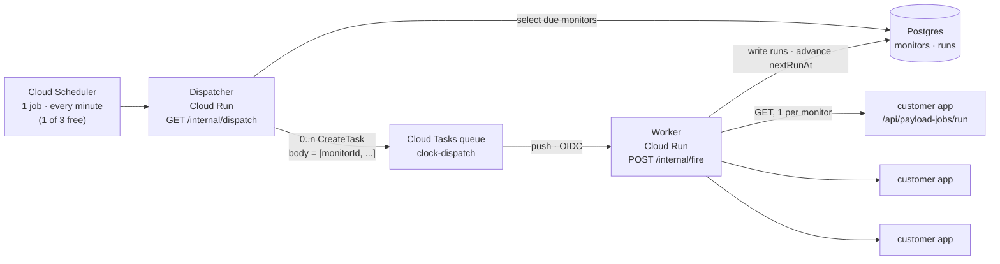

# Payload Clock — technical specification

| | |
| --- | --- |
| Working name | Payload Clock (payloadclock.com). Companion plugin `@payload-solutions/plugin-clock`, product name pending the Payload trademark answer, same rule as the other plugins. |
| Status | Specified, 12 September 2026. Nothing built. The app will be scaffolded with `create-payload-stack`; the marketing site is being rebuilt in this pass as `apps/payload-clock-web`. |
| Scope | A hosted service that calls a Payload deployment's `/api/payload-jobs/run` endpoint on schedule, records the outcome, and alerts on failure — so serverless Payload projects get a job queue that actually runs. Plus an admin plugin that connects a project and shows its next and recent runs without leaving the Payload admin. |
| Reference implementation | cron-job.org (free tier, run history, failure notifications); Vercel Cron (the thing users reach for first and outgrow); Upstash QStash and EasyCron as the paid comparison. |
| Related | `packages/create-payload-stack/src/scheduler.ts` — the CLI's `--runner` question already recommends Payload Clock, so this service is what that recommendation has to be worth; `notes/plugin-action-scheduler-spec.md` (the ledger this triggers, and the size discipline this spec copies), `docs/payload-clock/index.mdx` (the public stub, which this supersedes), `notes/HANDOFF.md`, `apps/payload-clock-web` (the site). |
| Verified against | Payload `v3.88.0` as installed in this monorepo — `src/queues/endpoints/run.ts` read in the `~/Projects/payload` checkout for the exact contract; Google Cloud Tasks pricing and quotas pages (fetched 12 September 2026); Google Cloud Scheduler pricing (same date). |
| License | MIT for the plugin and the sites. The hosted service's own source lives in the monorepo under the same licence. |

---

## 1. Summary

Payload's job queue does not run itself. On a long-lived server `autoRun` handles that; on Vercel, Netlify, Cloudflare and every other serverless target nothing executes between requests, so queued tasks and `schedule`d workflows sit untouched until somebody happens to load a page. The standard answer is a platform cron, and the standard problem is that platform crons are rationed: Vercel's Hobby plan allows two cron jobs at a **daily** minimum, which is not a job queue, it is a nightly batch.

Payload Clock is the missing hand on the clock. A project registers its deployment URL and a secret; Clock calls `GET /api/payload-jobs/run` on a schedule, reads the response Payload already returns, drains the queue when there is more work, records a compact run row, and emails when the endpoint starts failing. The companion plugin puts the next run and the last few runs inside the Payload admin, next to the jobs they trigger.

The service is free. That is the product decision everything else in this document serves: **the architecture is chosen so that a free tier is not a subsidy.** Section 3 is therefore the most important section here, and its conclusion is a single number — one minute of dispatch costs two Google Cloud Tasks operations no matter how many customers are due in that minute, because the batch, not the ping, is the unit Google charges for.

## 2. Goals and non-goals

Goals:

- A Payload project on any serverless host gets a job queue that runs on time, with no infrastructure of its own and no credit card.
- Run history that answers "did it run, when, how long did it take, what did it return, why did it fail" without a developer.
- Failure alerts that arrive before the customer notices, and an automatic pause for deployments that are plainly gone.
- Zero-config for the common case: one monitor per project, default cadence, done in two fields.
- A cost model that stays inside Google's free tier at a realistic scale, and degrades predictably past it.

Non-goals:

- A general-purpose cron service for arbitrary URLs. Clock pings Payload deployments. The endpoint contract, the response parsing, the drain loop and the plugin all assume that. Pinging anything else is how this becomes an open HTTP relay (§10).
- Sub-minute precision. The unit is the minute, exactly as a cron expression is. "Every 30 seconds" is not offered.
- Executing anything. Clock never runs customer code, never sees job payloads, and stores no application data. It calls one URL and records a status code.
- Replacing the Action Scheduler. That plugin owns the ledger and the semantics; Clock owns the trigger. A project can use either alone.

## 3. The cost model, and why the architecture looks like this

### 3.1 What Google charges for

| Service | Free tier | Beyond |
| --- | --- | --- |
| Cloud Tasks | **1,000,000 billable operations per month** | $0.40 per million, to 5 billion |
| Cloud Scheduler | **3 jobs per billing account per month** | $0.10 per job per 31 days |
| Cloud Run | 2M requests, 180k vCPU-seconds, 360k GiB-seconds per month | metered |

A Cloud Tasks **billable operation** is one API call *or* one push delivery attempt. Creating a task and delivering it is therefore two operations. Tasks are chunked at 32 KB for billing, and `ListTasks` bills one operation **per task returned** — which is the single most expensive mistake available here, and §3.4 forbids it.

Relevant hard limits: max task size 1 MiB; max schedule time 30 days ahead; queue dispatch rate 500/s; 1,000 queues per region; task retention 31 days; HTTP-target dispatch deadline 10 minutes by default, 30 maximum.

### 3.2 The naive design, and why it fails

The obvious design gives every scheduled ping its own Cloud Task: create it with `scheduleTime` set to the moment it is due, let Cloud Tasks deliver it. Clean, and it uses exactly the feature Cloud Tasks exists for.

It also costs **two operations per ping**, which puts the free tier at 500,000 pings a month. One customer on a one-minute schedule burns 43,776 pings — 87,552 operations. **Eleven such customers exhaust the entire free tier.** For a service whose headline is "free", that is not a scaling concern, it is a launch-week concern.

### 3.3 The design: batch the minute, not the ping — **Decided**

Because Clock's own worker makes the outbound call (rather than pointing Cloud Tasks at the customer's endpoint), Cloud Tasks does not need to know about individual pings at all. It carries **buckets**.



One minute, step by step:

1. Cloud Scheduler fires the single tick job at `* * * * *`. **Zero Cloud Tasks operations. Zero cost** — it is one of the three free jobs.
2. The dispatcher runs one indexed query: `SELECT id FROM monitors WHERE enabled AND next_run_at <= now() + interval '60 seconds' ORDER BY next_run_at LIMIT 5000`.
3. If nothing is due, it returns. **Zero Cloud Tasks operations for an idle minute** — and most minutes on a young service are idle.
4. Otherwise it slices the due set into buckets of at most `BATCH_SIZE` (default **50**) monitor ids and creates one Cloud Task per bucket, `scheduleTime` at the top of the coming minute, body a JSON array of ids. It immediately advances each monitor's `next_run_at` and stamps `dispatch_seq`, so the same monitor cannot be enqueued twice (§7.3).
5. Cloud Tasks delivers each bucket to the worker with an OIDC token.
6. The worker fires the bucket's pings with bounded concurrency (default 20), applies the drain rule (§6.3), writes the run rows (§8), and returns 200.

Cost per minute in which anything is due: **2 operations per bucket.**

### 3.4 The budget

| | Naive (task per ping) | This design (task per bucket of 50) |
| --- | --- | --- |
| Ops per minute, 1 monitor due | 2 | 2 |
| Ops per minute, 500 monitors due | 1,000 | 20 |
| Ops per month, one bucket every minute | — | **87,552** (8.8% of free tier) |
| Monitors supportable free, all on 1-minute schedules | **11** | ~550 due per minute → **~550** |
| Monitors supportable free, 15-minute average interval | 170 | **~8,000** |

The arithmetic for the last row: 1,000,000 ops ÷ 2 = 500,000 buckets/month ÷ 43,776 minutes = **11.4 buckets per minute** sustainable, × 50 monitors per bucket = 570 monitors due in any given minute; at a 15-minute average interval that is 570 × 15 ≈ 8,550 registered monitors. Add the Cloud Run side — 43,776 dispatcher invocations plus roughly 500,000 worker invocations a month — and it fits inside Cloud Run's 2M-request free tier with room to spare.

The rules that keep it there, all **Decided**:

1. **Never call `ListTasks`.** It bills one operation per task returned. The database is the source of truth for what is scheduled; Cloud Tasks is a delivery mechanism with no queryable state we care about.
2. **Never use named tasks.** Deduplication through task names adds latency by Google's own documentation, and §7.3's `dispatch_seq` claim already makes a double dispatch harmless.
3. **Never enqueue further ahead than the next occurrence.** Cloud Tasks accepts a 30-day horizon, and using it would mean deleting tasks whenever a customer edits or pauses a monitor — every delete is another billable operation, and a missed delete is a ping the customer explicitly turned off.
4. **An idle minute costs nothing.** The dispatcher creates zero tasks when zero monitors are due.
5. **Dead projects stop costing money.** Consecutive failures pause a monitor automatically (§9).
6. **One monitor per project is the default**, not one per queue or per job — see §6.1. This is the largest single lever, and it is a product decision rather than an infrastructure one.

### 3.5 Scaling levers, in the order they should be pulled

1. Raise `BATCH_SIZE` from 50 to 200. Ops fall 4×; the worker's per-invocation wall time rises. Bounded by the 10-minute dispatch deadline, not by anything else.
2. Raise the free plan's minimum interval from 1 minute to 5. Ops fall 5× for the customers who do not need the precision, which is nearly all of them.
3. Shard buckets by `hash(monitor_id) % N` so they spread across the minute instead of all firing at `:00`. Costs nothing extra; smooths the outbound load.
4. Pay. At $0.40 per million operations, the first million ops beyond the free tier costs forty cents. This is worth stating plainly in the internal doc so nobody panics: **the free tier is a nicety, not a cliff.** Ten thousand active monitors at a 5-minute average interval costs single-digit dollars a month.

## 4. The endpoint contract (verified against Payload 3.88)

From `payload/src/queues/endpoints/run.ts`:

- The route is **`GET /api/payload-jobs/run`** — GET, deliberately, "to allow it to be used in a Vercel Cron". Clock issues GET.
- Query parameters, all optional: `queue` (a single queue name), `allQueues` (`'true'`/`'false'`), `limit` (number), `silent` (`'true'`), `disableScheduling` (`'true'`).
- Authorisation runs through `jobsConfig.access.run`, which defaults to `defaultAccess` — i.e. **an authenticated Payload user**. A project that has not set `jobs.access.run` will return 401 to Clock, and the setup flow must say so in those words (§11.2).
- On success it returns **200** with `{ message, noJobsRemaining: boolean, remainingJobsFromQueried: number }`.
- On a failed access check, **401** with `{ message }`.
- On a throw inside `runJobs`, **500** with `{ message, noJobsRemaining: true, remainingJobsFromQueried }`.
- When the config has no tasks and no workflows at all, **200** with `{ message: 'No jobs to run.' }` and neither counter.

Two consequences worth naming, because they are what makes Clock better than a plain cron:

- `noJobsRemaining` and `remainingJobsFromQueried` let Clock tell "ran, nothing to do" apart from "ran, did work" apart from "ran, there is more". A plain cron sees 200 and learns nothing. §6.3 spends this on the drain loop and §8.3 spends it on collapsing the run ledger.
- `disableScheduling=true` exists. A project with several queues can have one monitor handle schedules and the rest skip that work, which matters because `handleSchedules` runs on every call otherwise.

## 5. Architecture

| Piece | Runs on | Why there |
| --- | --- | --- |
| `payloadclock.com` marketing site | Vercel, static Next.js | Same as payloadstack.com. `apps/payload-clock-web`. |
| App: dashboard, Payload admin, public API | Vercel | Scaffolded by `create-payload-stack`. `apps/payload-clock`. |
| Dispatcher + worker | **Cloud Run** | Cloud Tasks → Cloud Run with OIDC is the first-party path; it authenticates without a shared secret, has its own generous free tier, and keeps the per-minute machinery off the app's serverless budget. `apps/payload-clock-runner`. |
| Database | Postgres (same instance as the app) | The runner needs the same rows the dashboard shows. One database, no sync. |
| Timer | Cloud Scheduler, one job | Free, and the only piece that has to exist outside a request. |

**Decided:** the runner is a separate small service, not a route inside the Next.js app. It is called 43,776 times a month by machinery and never by a browser; it needs a long dispatch deadline and a connection pool that is not recreated per invocation; and keeping it separate means a bad deploy of the marketing site cannot stop the clock.

## 6. The product: projects, monitors and the drain rule

### 6.1 One monitor per project is the default — **Decided**

Payload already has its own scheduler inside the run endpoint: `handleSchedules` evaluates every `schedule` in the jobs config on each call. A project with a nightly cleanup, an hourly digest and a five-minute sync does **not** need three Clock monitors. It needs one monitor calling the endpoint often enough that Payload's own scheduler notices each due job.

So the default and the recommended shape is: **one project, one monitor, one interval.** Per-queue monitors exist for the case that genuinely needs them — a heavy queue that must be drained on a different cadence from a light one, or a queue that should be skipped entirely on the cheap interval — and the UI presents them as an advanced addition, not as the starting point.

This is the largest cost lever in the document and it costs the customer nothing. It also produces the better default experience: two fields to fill in, not a cron builder.

### 6.2 Schedules

| Field | Meaning |
| --- | --- |
| `interval` | `'1m' \| '2m' \| '5m' \| '10m' \| '15m' \| '30m' \| '1h' \| '6h' \| '12h' \| '24h'` — a fixed cadence from the first run. The default and the shape 95% of projects want. Default **5m**. |
| `cron` + `tz` | A five-field cron expression with an IANA time zone, for the project that wants "weekdays at 07:00 Europe/Warsaw". Parsed with `croner`, which Payload already depends on, so the same library evaluates schedules on both sides. |

Minute resolution, stated in the UI: a monitor scheduled for 09:30 fires somewhere in the 09:30 minute. `next_run_at` is always stored as an absolute UTC timestamp; the cron expression and time zone are stored beside it and re-evaluated after each run, so a DST transition is handled by croner rather than by arithmetic.

### 6.3 The drain rule — **Decided**

A single call to `/api/payload-jobs/run` processes up to the configured `limit` of jobs and returns. If the queue had 400 jobs waiting and the limit is 10, a plain cron leaves 390 of them for the next minute, and a backlog that arrives faster than one minute's worth never clears.

Clock reads the response. When `noJobsRemaining` is `false` and `remainingJobsFromQueried > 0`, the worker calls again **within the same invocation**, up to:

- `maxDrainCalls` — default **5**, ceiling 20, per monitor per dispatch;
- a wall-clock budget of **90 seconds** per monitor, well inside the 10-minute dispatch deadline;
- stopping early on any non-200, on `noJobsRemaining: true`, or when `remainingJobsFromQueried` stops decreasing (which means the queue is filling as fast as it drains, and hammering it further is not help).

Drain calls cost **zero** Cloud Tasks operations — they are ordinary outbound HTTPS from a Cloud Run instance that is already running. This is the clearest single argument for "our worker makes the call" over "Cloud Tasks calls the customer directly", and it should appear on the marketing site in one sentence.

### 6.4 Adaptive cadence — **Decided, opt-in, off by default**

A monitor that has returned `noJobsRemaining: true` for 60 consecutive runs is pinging an idle queue every minute for nothing. With `adaptive: true`, Clock widens the effective interval one step at a time (1m → 5m → 15m) after 60 consecutive empty runs at each step, and drops **straight back** to the configured interval on the first run that does any work.

Off by default because it is a behaviour change the customer did not ask for, and because a project relying on `handleSchedules` for a cron that fires once a day would have its precision quietly widened. Presented in the UI as "Save energy on idle queues", with the trade named.

## 7. Data model

Payload collections in `apps/payload-clock`. Multi-tenant by organization, per Payload Stack's existing tenant wiring.

### 7.1 `projects`

| Field | Notes |
| --- | --- |
| `name` | Display name. |
| `organization` | Tenant relationship. |
| `baseUrl` | The deployment origin, e.g. `https://app.example.com`. Validated per §10.1. Unique per organization. |
| `endpointPath` | Default `/api/payload-jobs/run`. Overridable because `routes.api` is configurable in Payload. |
| `authMode` | `'bearer' \| 'signature'` — see §11. |
| `secret` | Encrypted at rest (Payload field-level encryption, key in the runner's environment, never returned by the API — the dashboard shows it once at creation and never again). |
| `verifiedAt` | Set when ownership has been proven (§10.2). A project with no `verifiedAt` is never dispatched. |
| `status` | `active` / `paused` / `suspended`. |
| `notifyEmails` | Up to 3. Defaults to the organization owner. |
| `notifyWebhook` | Optional outbound URL for alerts, same URL rules as `baseUrl`. |

### 7.2 `monitors`

| Field | Notes |
| --- | --- |
| `project` | Relationship, indexed. |
| `label` | Defaults to the queue name, or "All queues". |
| `queue` / `allQueues` | Map straight onto the endpoint's query parameters. |
| `limit` | Passed through as `limit`. Default unset (Payload's own default applies). |
| `handleSchedules` | When false, sends `disableScheduling=true`. Exactly one monitor per project should have this true; the UI enforces it. |
| `schedule` | `{ kind: 'interval' \| 'cron', interval?, cron?, tz? }`. |
| `enabled` | Boolean. |
| `adaptive` | §6.4. |
| `nextRunAt` | **Indexed**, UTC. The dispatcher's only query predicate besides `enabled`. |
| `dispatchSeq` | Integer, incremented on dispatch. The claim token (§7.3). |
| `lastRunAt`, `lastStatus`, `lastDurationMs` | Denormalised for the list view, so rendering a project does not read `runs`. |
| `consecutiveFailures` | Drives the alert and the auto-pause (§9). |
| `adaptiveStep`, `consecutiveEmpty` | Adaptive-cadence state. |

Composite index on `(enabled, next_run_at)`. That index *is* the dispatcher.

### 7.3 Claiming, and why a double dispatch is harmless

The dispatcher advances `next_run_at` and increments `dispatch_seq` in the **same statement** that selects the monitor:

```sql
UPDATE monitors
   SET next_run_at = <computed>, dispatch_seq = dispatch_seq + 1
 WHERE id = ANY($1) AND enabled AND next_run_at <= $2
RETURNING id, dispatch_seq;
```

The bucket body carries `{ id, seq }` pairs. The worker records a run only if the monitor's `dispatch_seq` still equals the `seq` it was given. A Cloud Tasks retry after a worker crash therefore either re-fires a ping that never happened (correct) or is discarded because a later dispatch has already moved the monitor on (also correct). No lock, no lease, no second runner to operate — the same shape the Action Scheduler spec uses for its ledger, and for the same reason.

## 8. The run ledger, and the size rule

The Action Scheduler spec's §4.1 exists because job history grows without bound. Clock has the same problem in a sharper form: a single one-minute monitor produces **43,776 runs a month**, and unlike an application's jobs, almost every one of them is identical and says nothing.

### 8.1 What a run row holds

`monitor`, `project`, `startedAt`, `durationMs`, `httpStatus`, `outcome` (`ok` / `empty` / `worked` / `http_error` / `timeout` / `network_error` / `unauthorized`), `jobsRemaining`, `drainCalls`, and `error` — a message truncated to **200 characters**, no stack, no response body. A row is well under 300 bytes.

Never stored: the response body beyond the three known fields, request or response headers, the secret, anything resembling job input.

### 8.2 Retention — **Decided**

7 days for `ok` / `empty` / `worked`; 30 days for every failure outcome. Purged by the dispatcher's own tick, one bounded `DELETE ... WHERE started_at < ...` per run, so there is no second maintenance job to operate or to pay for.

### 8.3 Collapsing — **Decided, and the reason this ledger stays readable**

A run is **collapsed into the previous row** when it has the same `monitor`, the same `outcome`, the same `httpStatus`, and `jobsRemaining` is zero in both. Collapsing increments `repeatCount` and updates `lastAt`, `minDurationMs`, `maxDurationMs`. Any change — a different status code, a slower-than-usual response, actual work done — closes the collapsed row and opens a new one.

A healthy one-minute monitor with an idle queue therefore writes **one row per week** instead of 10,000, and the history reads the way an operator actually thinks: "nothing to report from Tuesday 09:14 to Friday 17:02, 11,208 runs, 40–95 ms; then three 500s; then nothing to report again." The failures are what survive, at full resolution, which is the whole point of keeping history.

## 9. Failure handling and alerts

| Consecutive failures | What happens |
| --- | --- |
| 1 | Recorded. Nothing sent — a single 502 during a deploy is not an incident. |
| 3 | Email to `notifyEmails`, webhook fired if configured. Names the status code and the last error, links to the run. |
| 20 | Monitor **auto-paused**, `status = suspended`, a second email explaining that it stopped and how to resume. |

A successful run resets the counter and, if an alert had been sent, sends one recovery email. Alerts are per monitor, and a project whose every monitor fails at once sends one email, not five.

Auto-pause is not only kindness to the customer's inbox. On a free service, abandoned deployments are the largest source of wasted operations, and twenty consecutive failures over an hour is a deployment that is gone.

Timeouts: a per-request timeout of **20 seconds** on the first call of a dispatch, **10 seconds** on drain calls. Payload's run endpoint is expected to return promptly; a project whose queue needs longer should lower its `limit` rather than hold a worker open.

## 10. Abuse, and the fact that this is an outbound HTTP relay

This is the part that is easy to skip and expensive to skip. A free service that fetches a URL of the customer's choosing, on a schedule, from Google's network, is a serviceable DDoS amplifier and an SSRF surface. **Decided** controls:

### 10.1 URL rules, enforced at save time *and* immediately before every request

- `https:` only. No `http:`, no other scheme.
- Port 443 only.
- The hostname must resolve to a **public** address. Reject loopback, link-local (169.254.0.0/16 including the cloud metadata address), RFC1918, CGNAT (100.64.0.0/10), IPv6 ULA and `::1`. Re-check after DNS resolution at request time, not only at save time, because a hostname's answer can change — this is the DNS-rebinding hole, and checking only at save time leaves it open.
- **Redirects are not followed.** A 3xx is an outcome, recorded as `http_error`. Following redirects re-opens every rule above.
- No credentials in the URL; path fixed to `endpointPath`; no customer-controlled headers beyond the auth header Clock itself constructs.
- Response body read with a hard cap of 64 KB, then discarded after the three fields are parsed.

### 10.2 Ownership verification — **Decided, required before first dispatch**

A project is not dispatched until `verifiedAt` is set. Verification, either route:

1. **Plugin route (preferred).** The customer installs `@payload-solutions/plugin-clock`, pastes the project token, and the plugin calls Clock's API from inside their own deployment. Possession of the token plus an outbound call from the origin being registered is the proof, and it happens in one click from their admin.
2. **Manual route.** Clock issues a one-time nonce; the customer serves it at `/{endpointPath}/../clock-verify` or as a DNS TXT record on the apex. For projects that do not want the plugin.

### 10.3 Quotas

Per organization on the free plan: **5 projects**, **10 monitors**, minimum interval **1 minute**, and a global ceiling of 20,000 outbound requests per day. Per-host: no more than 10 monitors across all organizations may target the same hostname without manual review — which catches both the accidental duplicate and the deliberate amplifier.

A global circuit breaker: if Clock's total outbound error rate crosses 40% over 5 minutes, dispatch pauses and pages the operator. That state is more likely to be a bug in Clock than an outage at 400 customers.

## 11. Authentication to the customer's deployment

Payload's `jobs.access.run` defaults to "an authenticated user", which returns 401 to anything Clock sends. Both modes below require the customer to set `access.run` themselves; the setup flow gives them the exact code.

### 11.1 Bearer (simple mode)

Clock sends `Authorization: Bearer <secret>`. The customer writes:

```ts
jobs: {
  access: {
    run: ({ req }) =>
      req.headers.get('authorization') === `Bearer ${process.env.CRON_SECRET}`,
  },
}
```

Works with vanilla Payload and no plugin. The weakness is the weakness of every shared secret: it is replayable by anyone who sees it, and it sits in two places.

### 11.2 Signature (with the plugin) — **the recommended mode**

Clock sends no secret. It sends `X-Clock-Timestamp` and `X-Clock-Signature: v1=<hex>`, where the signature is `HMAC-SHA256(secret, timestamp + '.' + method + '.' + path + '.' + sortedQuery)`. The plugin supplies the access function, which recomputes the HMAC in constant time and rejects a timestamp more than **300 seconds** old. The secret never crosses the wire, and a captured request is useless five minutes later.

```ts
import { clockPlugin, clockAccess } from '@payload-solutions/plugin-clock'

export default buildConfig({
  plugins: [clockPlugin({ projectToken: process.env.PAYLOAD_CLOCK_TOKEN })],
  jobs: { access: { run: clockAccess() } },
})
```

## 12. `@payload-solutions/plugin-clock`

Small on purpose. Four things:

1. **`clockAccess()`** — the access function of §11.2. This alone is worth installing.
2. **Connect from the admin.** A "Payload Clock" entry in the admin nav: paste the project token, press Connect, and the plugin calls Clock's `/api/v1/projects/verify` from inside the deployment, which both verifies ownership (§10.2) and tells Clock the origin it was called from.
3. **Next and recent runs**, rendered in that same view and as an optional card on the dashboard: the next scheduled run, the last ten runs with status and duration, and a "Run now" button that asks Clock to dispatch immediately (rate-limited to once a minute).
4. **`jobsRemaining` awareness.** When the project also runs the Action Scheduler, the view links each run to the actions it triggered. Optional, detected at runtime, no hard dependency.

The plugin never becomes required. A project can use Clock with bearer auth and never install it; the plugin buys the signature mode, one-click verification and the in-admin view.

## 13. Public API

`https://api.payloadclock.com/v1`, Better Auth API keys, scoped to an organization.

| Method | Path | Purpose |
| --- | --- | --- |
| `POST` | `/projects` | Register. Returns the token once. |
| `POST` | `/projects/:id/verify` | Called by the plugin from inside the deployment (§10.2). |
| `GET` | `/projects/:id` | Status, monitors, last run each. |
| `GET/POST/PATCH/DELETE` | `/monitors[/:id]` | CRUD. |
| `POST` | `/monitors/:id/run` | Dispatch now. Rate-limited to 1/minute. |
| `GET` | `/monitors/:id/runs` | Paginated history, collapsed rows expanded on request. |

Internal, never public, OIDC only: `GET /internal/dispatch` (Cloud Scheduler → dispatcher) and `POST /internal/fire` (Cloud Tasks → worker). Both verify the Google-signed OIDC token's audience and service-account email; neither accepts a shared secret.

## 14. Milestones

| | Scope |
| --- | --- |
| **M0** | `apps/payload-clock-web` rebuilt in the premium-black design language. Positioning corrected: Clock is the trigger, the Action Scheduler is a separate plugin. *(This session.)* |
| **M1** | `create-payload-stack` scaffold of `apps/payload-clock` (Postgres, organizations on, Stripe off). Collections of §7. Dashboard: add a project, add a monitor, see runs. |
| **M2** | `apps/payload-clock-runner` on Cloud Run: dispatcher, worker, drain loop, run ledger with collapsing, the Cloud Scheduler tick, the Cloud Tasks queue. The service works end to end for one hand-registered project. |
| **M3** | §10 in full — URL rules, verification, quotas — plus §9 alerts. Nothing is public before this milestone; §10 is the gate, not a follow-up. |
| **M4** | `@payload-solutions/plugin-clock` 0.1: `clockAccess()`, connect, next/recent runs. Docs at payload.solutions/docs/payload-clock. |
| **M5** | Public beta. Free plan quotas of §10.3, adaptive cadence, the public API. |

## 15. Open questions

1. **Does the free plan ever end?** The current position is that it does not, and that a paid tier buys shorter minimum intervals, longer retention and more projects rather than un-crippling the free one. Worth deciding before the site promises anything, because the site is being written now.
2. **Should Clock run the Action Scheduler's `runQueue` endpoint instead of `/api/payload-jobs/run` when it detects the plugin?** The scheduler's own endpoint honours priority ordering, which the raw job runner does not. Probably yes, as an auto-detected preference; it is one extra field on the monitor.
3. **Cloud Run region.** `europe-central2` (Warsaw) is nearest to the operator; most customers' deployments will be `iad1`/`us-east-1`. Latency on a job-queue ping does not matter, but egress and the Cloud Tasks queue must sit in the same region as the worker.
4. **What happens to the existing payloadclock.com audience?** The old site sold the Action Scheduler under the Clock name and pointed at `mpresecan/payload-action-scheduler`. That repository's README and any inbound links need redirecting to payload.solutions/docs/plugins/payload-action-scheduler.
