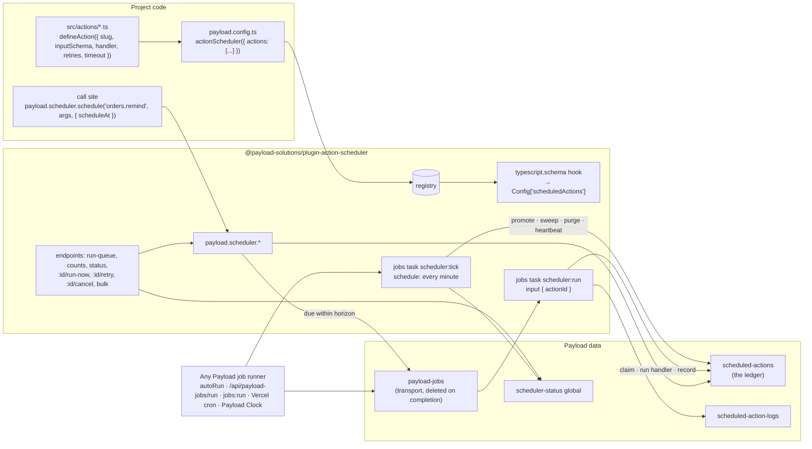

# Action Scheduler plugin for Payload — technical specification

| | |
| --- | --- |
| Working name | `@payload-solutions/plugin-action-scheduler` (product name "Payload Action Scheduler" pending the Payload trademark answer; same rule as the consent and emails plugins) |
| Status | Implemented as `packages/plugin-action-scheduler` (0.1.0, 11 September 2026): engine, API, maintenance, endpoints, admin UI, unit tests (64) and integration/e2e specs written. Integration and e2e suites are not yet run on the Mac. Where code and spec differ, the code wins. Deviations: endpoints live under `/scheduler/*` (§13); the run lock is three scalar fields on the status global; `cronstrue` was replaced by the plugin's own `describeCron`; Create New uses Payload's default create view with a live cron preview rather than a custom view (§12.10). |
| Scope | Payload 3.x plugin: named, typed actions scheduled at runtime with arguments — once, as soon as possible, on an interval or on a cron — executed by Payload's job queue, recorded in a small ledger, operated from a first-class admin view |
| Reference implementation | WooCommerce Action Scheduler (`as_*` API, `actionscheduler_actions` / `actionscheduler_logs` tables, Tools → Scheduled Actions) |
| Related | `docs/plugins/payload-action-scheduler/index.mdx` (public stub), `notes/plugin-emails-spec.md` (format precedent, `queue` option that this plugin will serve), `docs/payload-clock/index.mdx` (hosted runner) |
| Verified against | Payload `v3.88.0` as installed in this monorepo (`payload/dist/queues/**`, `payload/dist/config/sanitize.js`, `@payloadcms/drizzle/dist/updateOne.js`, `@payloadcms/ui` exports, `croner@10.0.1`); Payload `4.0.0-canary.14` checkout in `~/Projects/payload`; actionscheduler.org API and performance pages (fetched 11 September 2026) |
| License | MIT |

---

## 1. Summary

An action is a named piece of server code (`orders.remind`) plus a small JSON argument object (`{ orderId: 'a1' }`), scheduled to run at `scheduleAt`, as soon as possible, every N seconds, or on a cron expression. Application code schedules with one typed call — `payload.scheduler.schedule('orders.remind', { orderId }, { scheduleAt })` — and the plugin records the action in its own `scheduled-actions` collection, the **ledger**. When the action is due, Payload's job queue executes it through a single plugin task whose input is only `{ actionId }`. The handler's outcome — success, retry, failure, timeout — is written back to the ledger as a few scalar fields and one short log line.

The admin gets what WooCommerce users rely on and Payload lacks today: a Scheduled Actions view with status tabs and counts, human-readable schedules, a **Run queue** button with the last run's summary, a runner health signal, per-row Run now / Retry / Cancel, and a log timeline per action.

The single most important constraint is **size**. Payload deletes successful jobs because each job document stores its input as JSON and every log entry re-stores input, output and error JSON; history kept that way reaches hundreds of megabytes per run. The ledger is designed so that cannot happen: arguments are capped and stored once, handler output is never stored, only the latest error is kept (truncated), logs are short capped lines without payloads, and the Payload job that carries the execution holds nothing but an id and is still deleted on completion (§4).

## 2. What is being ported from Action Scheduler

| Action Scheduler | This plugin | Notes |
| --- | --- | --- |
| `add_action( $hook, $callback )` | `defineAction({ slug, handler })` registered in plugin options | **Decided:** typed registry, one handler per hook. No global event bus. |
| `as_schedule_single_action( $timestamp, $hook, $args, $group, $unique, $priority )` | `schedule(hook, args, { scheduleAt, group, unique, priority })` | **Decided:** the option and the ledger field are both named `scheduleAt`. |
| `as_enqueue_async_action( … )` | `enqueue(hook, args, opts)` | `scheduleAt = now`; shown as "ASAP" in the admin. |
| `as_schedule_recurring_action( $timestamp, $interval_in_seconds, … )` | `recurring(hook, args, { every: '1h', startAt })` | Durations as strings or seconds. |
| `as_schedule_cron_action( $timestamp, $schedule, … )` | `cron(hook, args, { cron: '0 9 * * 1', tz })` | Time zones supported (croner, already a Payload dependency). |
| `as_unschedule_action` (next occurrence) / `as_unschedule_all_actions` | `cancel(hook, match)` / `cancelAll(hook, match)` / `cancelByID(id)` | Same "next vs all" semantics. |
| `as_next_scheduled_action` → timestamp, `true`, `false` | `next(hook, match)` → `Date`, `'running'`, `null` | |
| `as_has_scheduled_action` | `has(hook, match)` | Indexed existence check on `argsHash`. |
| `as_get_scheduled_actions( $args )` | `find({ hook, status, group, … })` | Payload `PaginatedDocs`. |
| `$unique` (default false) | `unique` (default false; **true** for `recurring` and `cron`) | Enforced by a unique index, not a read-then-write check (§9.7). |
| `$priority` 0–255, default 10, lower first | Same range, default and ordering | Honoured when dispatching and by the Run queue button; see §9.8 for the limits under external runners. |
| `$group` | `group` (default `'default'`) | Filterable, shown under the hook name. |
| Statuses pending / in-progress / complete / failed / canceled; "past-due" in the admin | pending / running / complete / failed / canceled; past-due is derived | Timeout and lost-worker are failure *reasons*, not statuses. |
| No automatic retries | **Decided:** 3 retries with exponential backoff by default | `retries: 0` restores Action Scheduler behaviour. |
| Queue runner: batch 25, 30 s time limit, 1 concurrent batch, triggered by WP-Cron | Payload's job runner (`autoRun`, `/api/payload-jobs/run`, `payload jobs:run`, Vercel cron, Payload Clock) plus the Run queue button | No second runner to operate. |
| `actionscheduler_logs` table | `scheduled-action-logs` collection, capped per action | Short lines only (§8.2). |
| Retention: completed/canceled purged after a month; failed kept three months (4.0) | Per-status retention, defaults 7 d / 7 d / 90 d | Smaller default for completed; failed matches AS 4.0. |
| Tools → Scheduled Actions | Scheduled Actions list view, log drawer, detail view (§12) | Built on Payload's own list view. |
| WP-CLI `wp action-scheduler run` | `payload.scheduler.runQueue()`, the Run queue endpoint; `payload jobs:run` keeps working | A `payload scheduler:*` bin is M3. |

## 3. Goals and non-goals

Goals:

- Runtime scheduling with arguments, including recurring and cron actions created by application code, not only by config.
- History that is useful for operations and bounded in size by construction.
- Exactly-once execution per attempt, even with several runners on one database (§9.3).
- Recovery from runners that die mid-action, on Payload 3.x where the queue itself does not recover.
- An admin view good enough that a site owner can answer "did it run, when, why did it fail, when is the next one" without a developer.
- Zero new infrastructure: any setup that runs Payload jobs runs actions.

Non-goals:

- Workflows (multi-step, resumable). Payload workflows exist for that; an action may queue one.
- Sub-second precision or high-throughput streaming. The unit is "roughly on the minute", like Action Scheduler.
- Storing handler results. If a result matters, the handler writes it to a real collection.
- Replacing Payload's jobs API. Tasks and workflows keep working beside the plugin.

## 4. Why not use `payload-jobs` directly (verified in 3.88)

| Gap | Evidence | Consequence |
| --- | --- | --- |
| `deleteJobOnComplete` is global and defaults to `true` | `queues/config/types/index.d.ts:131`, `operations/runJobs/index.js:400` | Keeping history means keeping it for every job in the app. |
| Every log entry stores `input`, `output` and `error` JSON | `logFields` in `queues/config/collection.ts` | History grows with payload size × tasks × attempts: the size problem. |
| Native `schedule` is config-time cron with empty input | `operations/handleSchedules/index.js` | No runtime "every hour for order 42". |
| `payload-jobs` is `admin.hidden: true` | `queues/config/collection.js:106` | No admin UI. |
| A runner that dies leaves `processing: true` | no lease fields in 3.88 | Stuck jobs, and scheduled tasks for that queue stop being queued. |
| Claims are read-then-write | `@payloadcms/drizzle/dist/updateOne.js` selects the id, then updates | Two runners can pick the same job. |
| Concurrency keys need `enableConcurrencyControl` (migration) | `queues/config/collection.js:14–26` | Opt-in only. |

Payload 4 canary adds leases and safe multi-worker claims (#17220, #17441) and turns concurrency and stats on (#17504, #17505). That removes the last two rows for the transport job, not the first four. The plugin works on both and stands its 3.x workarounds down on 4.x (§10.2).

### 4.1 The size rule (Decided)

The ledger must stay small. Concretely:

1. **Arguments are stored once**, on the action row, as JSON, capped by `maxArgsBytes` (default 8 KB of UTF-8 JSON). Over the cap, `schedule()` throws `ActionArgsTooLarge` before anything is written. Arguments must be JSON-serializable; relationship documents are rejected with a hint to pass ids.
2. **The transport job carries only `{ actionId }`.** Its task always completes successfully — failures are recorded on the ledger and retries are new transport jobs — so Payload's default `deleteJobOnComplete: true` still deletes it. `payload-jobs` therefore holds only waiting or in-flight rows, each a few hundred bytes.
3. **Handler output is never stored.** A handler may return `{ note }` (≤ 256 characters), shown in the admin.
4. **Only the latest error is kept**: message ≤ 1,000 characters, stack ≤ 2,000 characters (first frames). Earlier attempts survive only as one log line each.
5. **Logs are short lines**: event, level, message ≤ 500 characters, attempt, duration. Never arguments, output or stacks. A rolling window keeps the newest 50 lines per action.
6. **Recurring actions re-arm in place** (§9.6, open decision 1): one row per series, not one per occurrence.
7. **Retention** purges terminal rows and their logs by age.

Budget: a typical action row is under 1 KB; the hard ceiling is `maxArgsBytes` + 4 KB. A typical action's logs are under 1 KB; the ceiling is 50 × ~600 bytes. These numbers are asserted by tests (§19).

## 5. Architecture



One action, step by step:

1. `schedule()` validates the hook against the registry (compile-time via generated types, `ActionNotDefined` at runtime), serializes and measures the arguments, computes `argsHash`, and resolves `scheduleAt` (and, for recurring actions, the first occurrence).
2. In one transaction (the caller's `req` if given): insert the ledger row; if `scheduleAt` is within the **dispatch horizon** (default 15 minutes), queue a Payload job `scheduler:run` with `input: { actionId }`, `waitUntil: scheduleAt` and the action's `queue`, and store its id on the row. Later actions are promoted by the tick (§10.1).
3. A runner executes the job. The task loads the row and **claims** it with one atomic conditional update (`pending` and due → `running`, new `claimToken`, `claimedUntil = now + timeout + grace`, `attempts + 1`). If the claim fails — already running, canceled, rescheduled — the task returns and the job is deleted.
4. The handler runs with `{ args, action, req, payload, log, signal }` under the action's timeout.
5. The outcome is written with a second conditional update guarded by `claimToken`: complete; pending again with a backoff `scheduleAt` (retry); re-armed with the next occurrence (recurring); or failed. One or two log lines are appended. A new transport job is queued when the action has a next attempt or occurrence inside the horizon.
6. The transport job completes and Payload deletes it.

## 6. Developer experience

### 6.1 Declaring an action

```ts
// src/actions/orders-remind.ts
import { defineAction } from '@payload-solutions/plugin-action-scheduler'

export const ordersRemind = defineAction({
  slug: 'orders.remind',                 // /^[a-z0-9]+([.-][a-z0-9]+)*$/, unique
  label: 'Remind customer about unpaid order',
  description: 'Sends the payment reminder email for one order.',
  group: 'orders',                       // default group for this hook; callers may override
  inputSchema: [                         // Payload fields, like a jobs task's inputSchema
    { name: 'orderId', type: 'text', required: true },
    { name: 'attempt', type: 'number' },
  ],
  retries: 3,                            // Decided default; 0 = Action Scheduler behaviour
  backoff: { type: 'exponential', base: '30s', max: '1h' },
  timeout: '2m',                         // default '5m'
  unique: false,
  priority: 10,
  queue: 'default',                      // Payload queue the transport job goes to
  retain: true,                          // false: delete the row as soon as it completes
  handler: async ({ args, action, req, log, signal }) => {
    const order = await req.payload.findByID({ collection: 'orders', id: args.orderId, req })
    if (order.paid) return { note: 'already paid' }
    await req.payload.emails.send('payment-reminder', { input: { order }, req })
    log(`reminder sent to ${order.email}`)
  },
})
```

Handler context:

| Key | Type | Meaning |
| --- | --- | --- |
| `args` | generated input type | The stored arguments, parsed. |
| `action` | `{ id, hook, group, attempt, maxAttempts, scheduleAt, runCount, recurring }` | Read-only facts about this execution. |
| `req` | `PayloadRequest` | A fresh request with `payload`, a transaction and no user (system context). |
| `payload` | `Payload` | Convenience alias. |
| `log` | `(message: string, level?: 'info' \| 'warn' \| 'error') => void` | Buffered; flushed with the outcome update (one insert). Truncated to 500 characters. |
| `signal` | `AbortSignal` | Aborted on timeout or shutdown; pass it to `fetch` and long loops. |

Return `void` or `{ note?: string }`. Throw to fail the attempt (retried per policy). Throw `new PermanentError(message)` to fail without further retries. Throw `new SkipAction(reason)` to complete with a note without doing anything.

### 6.2 Registering

```ts
// payload.config.ts
import { actionScheduler } from '@payload-solutions/plugin-action-scheduler'
import { ordersRemind } from './actions/orders-remind'
import { cleanupCarts } from './actions/cleanup-carts'

export default buildConfig({
  plugins: [
    actionScheduler({
      actions: [ordersRemind, cleanupCarts],
      recurring: [
        // Declarative series, reconciled on init: created if missing, updated if the schedule changed,
        // canceled if removed from this list (by `key`). Code-owned; admins can pause but not edit.
        { key: 'carts.nightly', hook: 'cleanup.carts', args: {}, cron: '0 3 * * *', tz: 'Europe/Warsaw' },
      ],
    }),
  ],
})
```

### 6.3 Local API — `payload.scheduler` (Decided)

```ts
type Match<H> = { args?: ActionArgs<H>; group?: string }
type ScheduleOpts = {
  scheduleAt?: Date | string       // default now
  group?: string
  unique?: boolean
  priority?: number                // 0–255, lower first, default 10
  queue?: string
  req?: PayloadRequest             // join the caller's transaction
}

payload.scheduler.schedule(hook, args, opts)                      // → Promise<ScheduledActionRef>
payload.scheduler.enqueue(hook, args, opts)                       // scheduleAt = now
payload.scheduler.recurring(hook, args, { every, startAt?, ...opts })       // every: '15m' | '1h' | number (s)
payload.scheduler.cron(hook, args, { cron, tz?, startAt?, ...opts })        // tz default: plugin option, else UTC

payload.scheduler.cancel(hook, match?)        // next matching pending action → Promise<number> (0 or 1)
payload.scheduler.cancelAll(hook, match?)     // all matching pending actions → Promise<number>
payload.scheduler.cancelByID(id)
payload.scheduler.reschedule(id, scheduleAt)  // pending only
payload.scheduler.runNow(id)                  // pending or failed → scheduleAt = now, dispatched
payload.scheduler.retry(id)                   // failed → attempts reset, pending, dispatched

payload.scheduler.next(hook, match?)          // → Promise<Date | 'running' | null>
payload.scheduler.has(hook, match?)           // → Promise<boolean>
payload.scheduler.find({ hook?, status?, group?, where?, limit?, page?, sort? })   // → PaginatedDocs

payload.scheduler.runQueue({ limit?, maxDuration?, trigger? })   // what the admin button calls → RunSummary

type ScheduledActionRef = { id: string | number; scheduleAt: Date; created: boolean }
type RunSummary = { startedAt: Date; durationMs: number; ran: number; completed: number; failed: number; retried: number; trigger: 'manual' | 'runner' | 'clock' }
```

With `unique: true` and an existing pending or running action for the same hook, group and arguments, `schedule()` returns that action with `created: false` instead of throwing — Action Scheduler returns 0 in the same case; returning the existing reference is more useful.

`match.args` is compared by `argsHash` (SHA-256 of canonical JSON: keys sorted, `undefined` dropped), so `{ a: 1, b: 2 }` and `{ b: 2, a: 1 }` match.

Every method is also exported as a function taking `payload` first (`scheduleAction(payload, …)`) for code that only has a `Payload` instance type without the augmentation.

## 7. Type generation

Same mechanism as the emails plugin (`notes/plugin-emails-spec.md` §6): a `typescript.schema` hook converts each definition's `inputSchema` with Payload's `fieldsToJSONSchema` and adds

```ts
export interface Config {
  // …
  scheduledActions: {
    'orders.remind': { input: { orderId: string; attempt?: number | null } }
    'cleanup.carts': { input: Record<string, never> }
  }
}
```

`ActionSlug`, `ActionArgs<H>` and the `payload.scheduler` overloads read from `GeneratedTypes['scheduledActions']` and fall back to `string` / `Record<string, unknown>` before the first `generate:types`, exactly like `TypedJobs`. A definition without `inputSchema` may pass a type parameter instead: `defineAction<{ orderId: string }>({ … })`; that type wins in the overloads but gives no runtime schema for the admin form (§12.10).

## 8. Data model

### 8.1 Collection `scheduled-actions` (the ledger)

| Field | Type | Notes |
| --- | --- | --- |
| `hook` | text, indexed, required | Validated against the registry. Text, not `select`, so adding an action never needs a migration (a Postgres enum would). |
| `group` | text, indexed | Default `'default'`. |
| `status` | select `pending \| running \| complete \| failed \| canceled`, indexed | |
| `scheduleAt` | date, indexed | **Decided** name. Next due time for pending rows; last scheduled time for terminal rows. |
| `args` | json | ≤ `maxArgsBytes`. |
| `argsHash` | text, indexed | 32 hex chars of SHA-256 over canonical JSON. |
| `uniqueKey` | text, unique | `hash(hook, group, argsHash)` while pending/running with `unique`; `null` otherwise. |
| `priority` | number | 0–255, default 10. |
| `queue` | text | Payload queue for transport jobs. |
| `repeat` | select `once \| interval \| cron`, indexed | |
| `interval` | number | Seconds, for `interval`. |
| `cron` | text | For `cron`; validated with croner at schedule time. |
| `tz` | text | IANA zone, for `cron`. |
| `seriesKey` | text, indexed | `recurring[].key` for code-declared series. |
| `attempts` / `maxAttempts` | number | Attempts within the current occurrence. |
| `runCount` | number | Occurrences finished (recurring). |
| `consecutiveFailures` | number | Recurring: occurrences in a row that ended failed. |
| `lastAttemptAt` / `completedAt` | date | `lastAttemptAt` indexed (run summaries). |
| `lastDurationMs` | number | |
| `lastOutcome` | select `completed \| failed \| timeout \| lost \| skipped` | Drives the "Last result" cell. |
| `failureReason` | select `error \| timeout \| lost \| permanent \| handler-missing \| args-invalid` | Set when `status = failed`. |
| `errorMessage` / `errorStack` | text / textarea | Latest error only; ≤ 1,000 / 2,000 characters. |
| `note` | text | ≤ 256 characters, from the handler. |
| `claimToken` / `claimedUntil` | text / date (indexed) | Lease for the running attempt. |
| `jobId` | text | Current transport job, if any. |
| `stopAfterCurrent` | checkbox | Recurring: cancel instead of re-arming after the running occurrence. |
| `source` / `createdBy` | select `code \| admin \| series` / text | Admin user id for admin-created actions. |
| `logs` | join → `scheduled-action-logs.action` | Virtual; no storage. |

Compound indexes (`indexes`, available in 3.88 `CollectionConfig`): `(status, scheduleAt)`, `(hook, argsHash, status)`, `(group, status)`, `(status, claimedUntil)`. Versions, drafts, localization and document locking are off. `timestamps: true`.

### 8.2 Collection `scheduled-action-logs`

| Field | Type | Notes |
| --- | --- | --- |
| `action` | relationship → `scheduled-actions`, indexed, required | |
| `event` | select `scheduled \| dispatched \| started \| completed \| skipped \| failed \| retry \| timeout \| lost \| canceled \| rescheduled \| rearmed \| note` | Drives the timeline icon. |
| `level` | select `info \| warn \| error` | |
| `message` | text | ≤ 500 characters. Lifecycle messages are generated ("Retry 2/4 at 14:05", "Timed out after 2 min"). |
| `attempt` | number | |
| `durationMs` | number | On `completed`, `failed`, `timeout`. |

Rolling window: after an outcome write, rows beyond `logs.perAction` (default 50) for that action are deleted oldest-first in the same transaction. `logs: false` disables the collection; lifecycle facts remain on the row. The collection is admin-hidden; logs are read through the action's drawer and detail view.

### 8.3 Global `scheduler-status` (hidden)

`lastTickAt`, `lastRun` (`RunSummary`), `lastSweepAt`, `lastPurgeAt`, `runLock` `{ token, until, userId }`. A few hundred bytes. Read by the queue strip (§12.3).

### 8.4 What changes the schema

Adding the plugin adds two collections and one global (Postgres/SQLite users generate one migration). Adding or removing actions changes nothing. The tick task uses Payload's native `schedule`; Payload then enables `jobs.stats`, which adds the `payload-jobs-stats` global and a `meta` column on `payload-jobs` (verified: `config/sanitize.js:280–287`). Projects that already schedule tasks have both; others get them in the same migration. `tick: false` avoids them (§10.1).

## 9. Execution

### 9.1 Transport task `scheduler:run`

Registered in `config.jobs.tasks` with `inputSchema: [{ name: 'actionId', type: 'text', required: true }]`, `retries: 0` (the ledger owns retries) and no `outputSchema`. The handler catches everything from the action handler; it throws only for infrastructure failures (database down), in which case Payload keeps the job with `hasError` and the sweeper reconciles the action (§10.2).

### 9.2 Dispatch horizon

Queuing a transport job for every future action would make `payload-jobs` as large as the ledger and make cancel and reschedule touch two tables. Instead only actions due within `dispatchHorizon` (default `'15m'`) get a job at schedule time; the tick promotes the rest every minute, ordered by `priority` then `scheduleAt`, in batches of 500. With `tick: false` the horizon is infinite: every action is dispatched when scheduled.

### 9.3 Claims

The claim and the outcome write must be atomic compare-and-set operations. Payload's `db.updateOne({ where })` is not: the Drizzle adapter selects the id, then updates by id (`@payloadcms/drizzle/dist/updateOne.js`), so two runners can both "win". The plugin therefore claims through the adapter natively:

| Adapter | Claim |
| --- | --- |
| Postgres, SQLite (Drizzle) | `payload.db.drizzle.update(table).set({...}).where(and(eq(id), eq(status, 'pending'), lte(scheduleAt, now))).returning({ id })` against `payload.db.tables[tableName]` |
| MongoDB | `payload.db.collections['scheduled-actions'].findOneAndUpdate({ _id, status: 'pending', scheduleAt: { $lte: now } }, { $set, $inc }, { new: true })` |
| Anything else | Payload `updateOne` with a warning at init: "claims are not atomic on this adapter; run a single runner" |

The outcome write uses the same primitive with `claimToken` in the condition, so a late result after a timeout or a sweeper recovery is discarded (logged at `warn`).

### 9.4 Timeouts

`timeout` per definition (default `'5m'`, plugin-wide `defaultTimeout`). The task races the handler against a timer and aborts `signal`. JavaScript cannot kill the handler, so on timeout the attempt is recorded as `timeout`, the claim token is cleared, and whatever the handler does later cannot change the row. On serverless platforms the function limit usually bites first; the process dies and the sweeper records `lost` (§10.2). The docs must say: set `timeout` below the platform limit.

### 9.5 Retries and backoff (Decided)

`retries` default 3 → `maxAttempts` 4. Delay before attempt *n* + 1 is `min(max, base × 2^(n−1))` with ±20 % jitter; defaults `base: '30s'`, `max: '1h'` (30 s, 1 min, 2 min). `backoff: { type: 'fixed', delay }` and `backoff: (attempt, error) => Date | null` are supported. A retry sets `status: pending`, `scheduleAt` to the backoff time, records the error, logs "Attempt 2/4 failed: … · retry at 14:05", and dispatches a job if inside the horizon. `PermanentError`, `handler-missing` and `args-invalid` skip retries.

### 9.6 Recurring actions: re-arm in place (proposed; open decision 1)

One ledger row represents the series. When an occurrence ends (completed, skipped, or failed after its last attempt):

- `runCount + 1`, `lastOutcome`, `lastDurationMs`, `completedAt` are updated; `attempts` resets to 0.
- Next occurrence: `interval` → `max(previous scheduleAt + interval, now)`; `cron` → `new Cron(cron, { timezone: tz }).nextRun(now)`. Missed occurrences are skipped, never replayed in a burst (Action Scheduler behaves the same for cron). DST is croner's job; tests cover the Europe/Warsaw transitions.
- `status` returns to `pending` with the new `scheduleAt` and a `rearmed` log line, unless `stopAfterCurrent` is set (→ `canceled`) or `consecutiveFailures` reached `stopAfterFailures` (default `null` = never, like Action Scheduler) (→ `failed`).

History of past occurrences lives in the rolling log (50 lines ≈ the last 16–25 occurrences) and in `runCount` / `consecutiveFailures`. The admin shows recurring rows with the next run and a run count, not one row per past run.

### 9.7 Uniqueness

`unique: true` sets `uniqueKey` while the action is pending or running and clears it at any terminal status. The unique index makes concurrent `schedule()` calls safe: the loser catches the duplicate-key error and returns the winner's reference with `created: false`. Postgres and SQLite allow many `NULL`s in a unique index; MongoDB needs a partial index (`uniqueKey: { $type: 'string' }`) — verify what Payload's Mongo adapter generates for `unique: true` on an optional field before relying on it (open decision 3).

### 9.8 Priority and queues

Lower `priority` is dispatched first by the tick and claimed first by `runQueue()`. Payload's own runner orders jobs by its `processingOrder` (default `createdAt`), so under an external runner priority decides dispatch order, not strict execution order. Work that must never wait behind bulk work goes to its own `queue` (`queue: 'critical'`) and its own runner invocation. Documented plainly; Action Scheduler has the same caveat once batches are concurrent.

### 9.9 Cancel, reschedule, run now, retry

| Operation | Allowed from | Effect |
| --- | --- | --- |
| cancel | pending | `canceled`, transport job deleted (`payload.jobs.cancelByID`), `uniqueKey` cleared |
| cancel | running, recurring | `stopAfterCurrent: true`; becomes `canceled` when the occurrence ends |
| cancel | running, once | Refused (409): an attempt in progress cannot be stopped from another process |
| reschedule | pending | New `scheduleAt`, old job deleted, new job if inside the horizon |
| run now | pending, failed | `scheduleAt = now`, dispatched; from the admin also executed immediately via `payload.jobs.runByID` |
| retry | failed | `attempts = 0`, `pending`, `scheduleAt = now`, dispatched |
| delete | complete, failed, canceled | Row and logs removed |

## 10. Maintenance

### 10.1 Tick task `scheduler:tick`

A plugin task with Payload's native `schedule: [{ cron: '* * * * *', queue }]`, so any runner that handles schedules runs it: `autoRun`, `payload jobs:run --handle-schedules`, and `/api/payload-jobs/run`, which calls `handleSchedules` unless `disableScheduling` is passed (verified: `queues/endpoints/run.js:27–40`). Each tick, bounded to 10 seconds:

1. **Heartbeat**: `scheduler-status.lastTickAt = now`.
2. **Promote**: dispatch pending actions with no `jobId` due within the horizon.
3. **Sweep** (§10.2).
4. **Purge** (§10.3), at most once per hour.
5. **Run summary** for external runners: count actions whose `lastAttemptAt` is after the previous tick and store it as `lastRun` with `trigger: 'runner'` (or `'clock'` when the request is signed by Payload Clock).

With `tick: false`: no heartbeat (the admin shows "health unknown"), infinite horizon, and the sweep and purge run piggybacked on `runQueue()` and on every 50th execution.

### 10.2 Sweeper

- **Lost attempts**: `status: running` and `claimedUntil < now` → recorded as a failed attempt with reason `lost` ("Worker stopped responding"), then retried or failed per policy.
- **Orphaned rows**: `status: pending`, due, `jobId` set but the job no longer exists (deleted, or `hasError`) → re-dispatched.
- **Stuck transport jobs (3.x only)**: `payload-jobs` rows with `taskSlug: 'scheduler:run'` (and `scheduler:tick`) that are `processing: true` and older than the longest timeout + 5 minutes → deleted, so native scheduling of the tick is not blocked forever. On Payload 4 (`processingUntil` present on the jobs collection) this step is skipped; leases handle it.

### 10.3 Retention

Defaults: `complete` 7 days, `canceled` 7 days, `failed` 90 days (Action Scheduler 4.0 keeps failed actions three months). Purged in batches of 1,000 by `completedAt` / `updatedAt`; logs of purged actions go with them; orphan logs older than the longest retention are removed too. `retain: false` on a definition deletes completed rows immediately.

## 11. Runners

| Setup | How actions run |
| --- | --- |
| Long-lived server | `jobs.autoRun: [{ cron: '* * * * *', queue: 'default' }]` (Payload runs schedules and jobs) |
| Vercel / serverless | Vercel cron (or any scheduler) calling `GET /api/payload-jobs/run?allQueues=true` with the project's cron secret; Payload's endpoint also handles schedules |
| Separate worker | `payload jobs:run --all-queues --handle-schedules` on a schedule |
| Payload Clock | The hosted clock calls the same endpoint with retries, alerts and signed requests; its companion plugin reads `scheduler-status` |
| Admin | **Run queue** button → `POST /api/scheduled-actions/run-queue` |

`runQueue()` (button and API): takes `runLock` with the same atomic primitive (409 with who holds it and since when); sweeps and promotes; reads due pending actions ordered by `priority`, `scheduleAt` and executes each one's transport job with `payload.jobs.runByID` (dispatching first when it has none) until `limit` (default 25, as Action Scheduler) or `maxDuration` (default 20 s, under common serverless limits); writes `lastRun` with `trigger: 'manual'` and the user; releases the lock. The button never runs arbitrary host jobs.

## 12. Admin UX

Mockup: https://claude.ai/code/artifact/f19be45c-71cb-4861-9d73-d72d1b659d2e ("Payload Scheduled Actions", 11 September 2026; interactive: runner scenarios, Run queue, tabs, row and bulk actions, log drawer, Create New with cron preview; built on Payload 3.88's own colour and type tokens). Its cron wording and next-run maths are hand-rolled for the mockup; the plugin uses cronstrue and croner. The reference Michael liked is the Payload Clock screenshot `payloadclock.com/scheduled-actions-view.png`; §12.12 lists what is kept from it and what changes.

### 12.1 Principles

- **Native first.** The view is Payload's own list view for `scheduled-actions` — search, Columns, Filters, pagination, selection and preferences keep working. The plugin adds components through 3.88 slots (`admin.components.beforeListTable`, `listMenuItems`, `Description`, custom `Cell`s, `listSearchableFields: ['hook', 'group']`) rather than replacing the view.
- **One line per row, two at most.** Nothing in a cell grows with history. The log is a summary cell that opens a drawer.
- **Every time is local, relative and exact.** "14:05 · in 2 min", with the full date, time zone and UTC in the tooltip. No raw ISO strings.
- **Status is text plus colour**, never colour alone.
- **The page tells you whether anything is running the queue**, because on serverless the most common failure is that nothing ever does.

### 12.2 Layout, top to bottom

1. Breadcrumb and title "Scheduled Actions" with **Create New** (Payload's header).
2. Description (slot): "Deferred and recurring work, executed by the Payload job queue." — not "actions scheduled to run in the future", because the list includes finished actions.
3. **Queue strip** (§12.3).
4. **Status tabs** with counts (§12.4).
5. Payload's list controls: search "Search by action or group", Columns, Filters.
6. The table (§12.5), selection bar when rows are selected (§12.7), pagination.

### 12.3 Queue strip

```
[▶ Run queue]   Last run 35 s ago · via cron · ran 2 · 1 failed · 7.0 s        Next due 14:05 (in 2 min)   ● Auto-refresh
```

| State | Condition | Strip shows |
| --- | --- | --- |
| Healthy | `lastTickAt` within `runner.warnAfter` (default 5 min) | Neutral text as above; a green dot beside "Runner active". |
| Stale | No tick within `warnAfter` and something is due | Amber: "No runner has run the queue for 2 h · 14 actions past due · How to run the queue →" |
| Never | No tick ever recorded | Blue info banner in place of the summary: "Actions run when something runs the Payload job queue. Set up a runner →" with autoRun / Vercel cron / Payload Clock snippets in a popover. |
| Unknown | `tick: false` | Summary from the last execution; no health claim. |
| Running (button) | `runLock` held by this user | Button becomes "Running… 3 done" with a spinner; the table polls every 2 s. |
| Locked | `runLock` held by someone else | Button disabled; tooltip "Anna started a run 12 s ago". |

After a manual run: a toast "Ran 5 · 4 completed · 1 failed" with a "Show failed" link that switches to the Failed tab. The summary names its trigger (`manual` shows the user's name) so "2 total, 1 error" is never ambiguous. The strip reads `GET /api/scheduled-actions/status` (one global read + one indexed count for "next due").

### 12.4 Status tabs

`All 214 · Pending 12 · Running 1 · Past due 3 · Failed 2 · Completed 184 · Canceled 12`

- Tabs drive the list query through `useListQuery().handleWhereChange` (verified export in 3.88), so the state lives in the URL, survives reloads and composes with Filters and search.
- Past due = `pending` and `scheduleAt < now − 1 min`. Past due is amber, Failed is red; zero counts render muted.
- Counts come from `GET /api/scheduled-actions/counts` (six `payload.count` calls on the `(status, scheduleAt)` index) and refresh with the table.
- Default tab: Pending when anything is pending, otherwise All.

### 12.5 Columns

Default columns, in order:

| Column | Cell content | Notes |
| --- | --- | --- |
| ☐ | Payload selection | |
| **Action** | `orders.remind` in monospace, linked to the detail view; second line muted: group, and "↻" for recurring | Replaces "Endpoint" and the `@` prefix: these are in-process handlers, not HTTP endpoints. Unknown hook (removed from code): a warning pill "not registered". |
| **Status** | Pill: Pending (neutral), Running (neutral with a pulsing dot, elapsed "12 s"), Completed (`--theme-success-*`, which is Payload's blue-teal, not green), Failed (`--theme-error-*`), Canceled (outlined, muted strike). Second line for failed: reason ("timed out", "worker lost", "error"). Past-due pending shows an amber "past due" tag. | Timeout is a reason under Failed, not a status. |
| **Schedule** | "Once", "ASAP", "Every hour", or the cron in words: "Every Monday at 09:00"; the raw expression beneath in small monospace; zone appended when it differs from the viewer's: "(Europe/Warsaw)" | cronstrue for words, 24-hour format by locale; croner for next run. "Non-repeatable" becomes "Once". |
| **Next / When** | Pending: "14:05 · in 2 min" (amber "3 min overdue" if past due). Running: "started 12 s ago". Terminal: "Completed 13:41 · 2 h ago". ASAP pending: "ASAP · queued 13:58". Tooltip: full local date-time, zone, UTC. | No ISO strings; "async" never appears in a date column. |
| **Attempts** | `1/4`; recurring rows show `run 38` beneath | Hidden values when `0/…` on never-run pending rows. |
| **Last result** | One line: "Completed · 1 ms", "Skipped · already paid", "Failed · ECONNRESET · retry 14:05", "Timed out after 2 min", "—" when never run. Click opens the log drawer. | Replaces the inline Log column that grew each row. |
| **Arguments** | One-line monospace chip, truncated at ~40 characters: `{"orderId":"a1"}`; tooltip shows pretty JSON; copy button on hover; "—" when empty | |
| ⋯ | Row actions menu (§12.6) | Always visible on touch; on hover otherwise. |

Optional (Columns menu): Priority, Queue, Group (as its own column), Runs, Last duration, Created, Created by, ID. Default sort: `scheduleAt` ascending on Pending/Past due, `updatedAt` descending elsewhere.

### 12.6 Row actions

| Action | Pending | Running | Completed | Failed | Canceled |
| --- | --- | --- | --- | --- | --- |
| Run now | ✓ | – | – | ✓ (as Retry) | – |
| Retry | – | – | – | ✓ | – |
| Reschedule… | ✓ | – | – | – | – |
| Cancel | ✓ | recurring: "Stop after this run" | – | – | – |
| Duplicate | ✓ | ✓ | ✓ | ✓ | ✓ |
| View log | ✓ | ✓ | ✓ | ✓ | ✓ |
| Delete | – | – | ✓ | ✓ | ✓ |

Run now and Retry from the admin execute immediately (`runByID`) and update the row in place with a toast; they respect `runLock`. Destructive actions confirm in a Payload modal. Code-declared series (`source: series`) show Cancel as "Pause series" and a note that the schedule is owned by code.

### 12.7 Bulk actions

With rows selected, `listMenuItems` offers Run now, Retry, Cancel and Delete, each applied only to rows where it is allowed ("Cancel 8 of 10 selected — 2 are already finished"). `POST /api/scheduled-actions/bulk { ids, op }`, max 500 ids. Payload's generic bulk edit is disabled (`disableBulkEdit: true`); bulk delete is replaced by the status-aware version.

### 12.8 Log drawer

Opened from the Last result cell or "View log". Payload `Drawer`.

- **Header**: hook (monospace), status pill, id with copy, "Open full page".
- **Facts**: Schedule (words + raw + zone), Next / When, Attempts, Runs (recurring), Group, Queue, Priority, Created (who, when, source).
- **Arguments**: pretty JSON, byte size against `maxArgsBytes` ("64 B of 8 KB"), copy.
- **Last error** (failed or retrying): message; stack collapsed behind "Show stack".
- **Timeline**: newest first; one line per event with icon, message, attempt tag, duration, relative time and exact time on hover. Retry lines show the next time. A "Older lines were trimmed (keeps the newest 50)" marker when the window has rolled.
- **Footer**: the row actions allowed in the current state.

### 12.9 Detail view

The collection's edit view uses the same sections as the drawer in Payload's document layout (facts in the sidebar). Fields are read-only except, while pending: `scheduleAt` (date-time picker, "Save" calls `reschedule`), `priority`, `group`, and `args` when the definition has an `inputSchema` (form, §12.10). Terminal actions are fully read-only.

### 12.10 Create New

A custom create view: pick an action (registered hooks, with label and description; unregistered hooks cannot be created from the admin), fill arguments with a form generated from `inputSchema` (same approach as the emails plugin's sample-data form; JSON editor fallback when only a type parameter exists), choose **When**: Now · At date and time · Every … · Cron. The Cron option previews the words and the next three runs as you type and rejects invalid expressions. Also: group, priority, unique (with "An identical pending action exists — open it" when it would be a no-op), and a size meter for the arguments. Admin-created actions record `source: admin` and the user.

### 12.11 Live updates, empty states, responsiveness

- Poll with `refineListData` (no page reload): every 5 s while the tab is visible and something in view is running or due within 5 minutes, or a run is in progress; every 30 s otherwise; paused when hidden. The manual refresh button stays for impatience.
- Empty: "Nothing scheduled yet" with a copyable `payload.scheduler.schedule(...)` snippet and a docs link. Filtered empty: "No failed actions" with a quiet check mark — an empty Failed tab is good news.
- Narrow widths: the strip wraps under the button; tabs scroll horizontally; the table keeps Action, Status, Next / When and ⋯ and hides the rest (Payload's table already scrolls horizontally when wider).
- Accessibility: tabs are a `tablist` with counts in their accessible names; pills carry text; the row menu and drawer are keyboard reachable; relative times have `<time datetime>`.
- Themes: only Payload's CSS variables (`--theme-elevation-*`, `--theme-success-*`, `--theme-error-*`, `--theme-warning-*`), so light and dark follow the admin.

### 12.12 From the reference screenshot

| Kept | Changed |
| --- | --- |
| Native Payload list view with search, Columns, Filters, selection | Inline Log column → one-line Last result + drawer |
| "Run Action Queue" button → **Run queue** | Summary names trigger and counts precisely; adds runner health and "next due" |
| Last run summary (time, counts, duration) | ISO UTC dates → local, relative, exact on hover |
| Raw cron with human-readable text | "At every 1st minute" → "Every minute"; "Non-repeatable" → "Once"; "async" → "ASAP" |
| Status pills | `timeout` becomes a Failed reason; Running and Past due added |
| Arguments as a JSON chip | Truncated, copyable, "—" when empty |
| Manual refresh | Adaptive polling |
| — | Status tabs with counts, row and bulk actions, attempts, detail view, Create New with a form |
| — | "Endpoint" / `@hook` → "Action" with group |
| — | HTTP codes (200/504) in the log → outcome words with attempt and duration |

### 12.13 Dashboard widget (M3)

A small card for the admin dashboard: runner health dot, "3 past due · 2 failed" linking to those tabs, next due time, Run queue.

## 13. Endpoints

All on the `scheduled-actions` collection (`/api/scheduled-actions/...`), JSON, authenticated admin user, checked against the access options in §16.

| Method and path | Purpose | Access |
| --- | --- | --- |
| `GET /status` | Queue strip: `lastRun`, `lastTickAt`, health, next due, `runLock` holder | `read` |
| `GET /counts` | Tab counts per status and past due | `read` |
| `POST /run-queue` `{ limit?, queue? }` | `runQueue()`; 409 when locked | `runQueue` |
| `POST /:id/run-now` · `/:id/retry` · `/:id/cancel` · `/:id/reschedule { scheduleAt }` | Row actions | `manage` |
| `POST /bulk { ids, op }` | Bulk actions | `manage` |
| `GET /:id/logs?limit=50` | Drawer timeline (also available via the join) | `read` |

Schedule descriptions (cron to words, next runs) are computed in the client with `cronstrue` and `croner` so the Create view can preview as you type.

## 14. Integrations

- **Payload Emails.** Today `queue: true` in the emails plugin queues `plugin-emails:send` with the serialized arguments in the job input — exactly the growth pattern this plugin avoids. With the scheduler installed, the emails plugin registers an `emails.send` action and routes `queue` through it; `send(slug, { input, sendAt })` becomes possible. Arguments are already reduced to ids by the emails serializer, so they fit `maxArgsBytes`. Change lives in `plugin-emails` (M3).
- **Payload Clock.** The hosted clock calls `/api/payload-jobs/run`; `scheduler-status` gives its companion plugin "next due" and health without a new endpoint. A signed Clock request marks the run summary `trigger: 'clock'`.
- **Payload Stack.** Not v1 (`notes/V1-SCOPE.md`). Later: a `--scheduler` step in `create-payload-stack` that adds the plugin, a runner for the chosen host (autoRun or Vercel cron), and moves the emails queue onto it.

## 15. Package layout and distribution

`packages/plugin-action-scheduler`, scaffolded with `create-payload-app -t plugin` (required; see the consent plugin notes), published as `@payload-solutions/plugin-action-scheduler`.

```
src/
  index.ts               actionScheduler, defineAction, errors, function-style API, types, BasePayload augmentation
  plugin.ts              collections, global, tasks, endpoints, typescript.schema, onInit (attach payload.scheduler, reconcile series)
  types.ts               ActionDefinition, TypedActions, ActionArgs, SchedulerAPI, RunSummary
  define.ts              defineAction + validation
  registry.ts
  api/schedule.ts, api/cancel.ts, api/query.ts, api/run-queue.ts
  engine/claim.ts        adapter-native compare-and-set (drizzle, mongoose, fallback)
  engine/execute.ts      transport task handler: claim, timeout, outcome, log flush
  engine/recurrence.ts   interval/cron next occurrence (croner), backoff
  engine/hash.ts         canonical JSON, argsHash, uniqueKey, size measurement
  maintenance/tick.ts, maintenance/sweep.ts, maintenance/purge.ts
  collections/scheduled-actions.ts, collections/scheduled-action-logs.ts, globals/scheduler-status.ts
  endpoints/*.ts
  typescript/schema.ts
  admin/QueueStrip.tsx, admin/StatusTabs.tsx, admin/cells/*.tsx, admin/RowActions.tsx, admin/BulkMenu.tsx,
  admin/LogDrawer.tsx, admin/ActionDetail.tsx, admin/CreateAction.tsx, admin/format.ts (dates, durations, cron words)
  exports/client.ts, exports/rsc.ts
dev/                     Next.js + Payload app with sample actions (succeeds, fails twice, times out, recurring, cron)
```

Peer dependencies: `payload ^3.88`, `@payloadcms/ui ^3.88`, `react ^19`. Dependencies: `croner` (same major as Payload's, 10.x), `cronstrue` (MIT, no dependencies; pin at scaffold time — the npm registry was not reachable from the cloud workspace on 11 September to confirm the current version).

## 16. Plugin options

```ts
type ActionSchedulerOptions = {
  actions: ActionDefinition[]                         // required
  recurring?: Array<{ key: string; hook: ActionSlug; args?: object; every?: Duration; cron?: string; tz?: string; group?: string; priority?: number }>
  collectionSlug?: string                             // 'scheduled-actions'
  logs?: false | { slug?: string; perAction?: number } // default { perAction: 50 }
  maxArgsBytes?: number                               // 8192
  defaultTimeout?: Duration                           // '5m'
  defaultRetries?: number                             // 3
  defaultBackoff?: Backoff                            // exponential 30s … 1h
  defaultTimezone?: string                            // for cron without tz; default 'UTC'
  dispatchHorizon?: Duration                          // '15m'
  tick?: false | { cron?: string; queue?: string }    // default every minute on 'default'
  retention?: { complete?: Duration | false; canceled?: Duration | false; failed?: Duration | false }  // 7d / 7d / 90d
  runner?: { warnAfter?: Duration; runQueueLimit?: number; runQueueMaxDuration?: Duration }         // 5m / 25 / 20s
  access?: { read?: Access; manage?: Access; runQueue?: Access; create?: Access }                    // default: any admin user
  admin?: { group?: string; hidden?: boolean; dashboardWidget?: boolean }                           // group 'System'
  disabled?: boolean                                  // keep collections for migrations; no execution, no API side effects
}
type Duration = `${number}${'s' | 'm' | 'h' | 'd'}` | number   // number = seconds
```

## 17. Security and privacy

- Handlers are never exposed over HTTP. Admin endpoints can only schedule, run or change actions whose hooks are registered in code.
- Arguments may contain personal data. The docs say "pass ids, not documents"; the size cap enforces most of it. Arguments are visible to users passing `read`; projects with sensitive arguments set `access.read` accordingly. Arguments never reach the log collection.
- `errorMessage` and `errorStack` can leak internals; they are shown only to `read` users and truncated. `redactError?: (error) => { message, stack }` lets a project scrub them before storage.
- `runQueue` is locked to one run at a time and limited in duration; the endpoint cannot be used to run arbitrary jobs.
- Handlers run without a user (`req.user` undefined); anything they do with `overrideAccess: false` must pass access for an anonymous request. Admin-created actions record who created them but do not run as that user.

## 18. Compatibility and constraints

- Payload `>= 3.88 < 5`. On 4.x the 3.x stuck-job sweep turns off (detected by `processingUntil` on the jobs collection); everything else is the same. Re-verify the jobs collection shape and `handleSchedules` when Stack moves to 4.
- Databases: Postgres and SQLite (Drizzle) and MongoDB with atomic claims; other adapters with a single-runner warning.
- Serverless: `autoRun` does not run between requests; use Vercel cron or Payload Clock. Handler timeouts must be below the platform function limit. The Run queue button's `maxDuration` defaults below common limits.
- Time: all stored times UTC; cron evaluated in `tz`; the admin formats in the viewer's locale and zone.
- Precision: about one minute with a per-minute runner. Under heavy load, execution order follows §9.8.

## 19. Testing

- **Unit** (vitest): canonical JSON and `argsHash` (key order, `undefined`, dates), size measurement and `ActionArgsTooLarge`, backoff (bounds, jitter range, custom function), next occurrence for interval and cron including Europe/Warsaw DST days and missed-run skipping, duration parsing, cron words (cronstrue wrapper incl. 24-hour locales), strip health state machine, row-action availability matrix.
- **Types** (`tsc --noEmit`): hook autocompletion, args required/optional per `inputSchema`, `@ts-expect-error` for unknown hooks and wrong args, fallback before `generate:types`.
- **Integration** (Payload on SQLite in-memory and Postgres in CI; MongoDB via `mongodb-memory-server`):
  - schedule → run → complete; **`payload-jobs` is empty afterwards**;
  - retry path with backoff times and log lines; `PermanentError`; `SkipAction`; timeout with a late result discarded;
  - **exactly-once**: two `payload.jobs.run` calls in parallel against the same due actions → each handler invoked once per attempt (the test that would fail with Payload's `updateOne`);
  - lost worker: row left `running` past `claimedUntil` → sweeper retries it; 3.x stuck transport job deleted;
  - unique: 20 concurrent `schedule()` calls → one row, 19 `created: false`;
  - recurring re-arm (interval and cron), `stopAfterCurrent`, `stopAfterFailures`, declarative series reconcile (create, update, remove);
  - dispatch horizon: far-future action has no job until the tick promotes it;
  - retention and log rolling window;
  - **size budget**: an action with 7.9 KB arguments that fails 10 times keeps its row under `maxArgsBytes + 4 KB` and ≤ 50 log rows under 30 KB total; a 1,000-occurrence recurring series stays one row;
  - endpoints and access (read / manage / runQueue), run lock 409.
- **E2E** (Playwright against `dev/`): tabs and counts, Run queue with toast and refreshed strip, stale-runner banner (tick stopped), row actions per status, bulk cancel with partial applicability, log drawer contents, Create New with cron preview, narrow viewport (400 px) layout.

## 20. Milestones

| | Scope | Outcome |
| --- | --- | --- |
| M1 Engine | Collections, global, `defineAction`, registry, `payload.scheduler` API, transport task, atomic claims (Drizzle, Mongo), timeouts, retries, recurrence (re-arm), unique, horizon + tick, sweeper, retention, type generation, unit + type + integration tests incl. size budget and exactly-once | Actions run reliably from code; history is bounded |
| M2 Admin | Queue strip + status endpoint, status tabs + counts, cells, row actions, bulk menu, log drawer, detail view, polling, empty states, E2E | Site owners operate it without a developer |
| M3 Ops | Create New with generated form and cron preview, declarative `recurring` series, dashboard widget, `payload scheduler:*` bin, emails `queue`/`sendAt` on the scheduler, per-group concurrency limits | Replaces ad-hoc crons in Payload Stack projects |
| M4 Ecosystem | Payload Clock companion (next runs, signed trigger), `create-payload-stack --scheduler`, docs + catalogue entry | Public beta on payload.solutions |

## 21. Open decisions

1. **Recurring storage** — re-arm one row in place (this spec; smallest, history in the rolling log) or one row per occurrence (Action Scheduler; every run browsable in the list; ~43k rows a month for a per-minute action before retention). Recommendation: re-arm.
2. **Tick via native `schedule`** — turns on `jobs.stats` (extra global, `meta` column). Alternative: no tick, health unknown, infinite horizon. Recommendation: tick on by default, `tick: false` documented.
3. **MongoDB unique index on an optional field** — confirm Payload's Mongo adapter output for `unique: true` on nullable text; if it is not partial/sparse, create the index in `onInit` ourselves.
4. **Retention defaults** — 7 d / 7 d / 90 d here versus Action Scheduler's month for completed.
5. **Editing arguments of pending actions in the admin** — allowed here when `inputSchema` exists. Alternative: read-only, "Duplicate and edit" only.
6. **Per-group concurrency (M3)** — Payload concurrency keys (needs `enableConcurrencyControl` on 3.x) or a plugin-side lock row per group.
7. **Name** — "Payload Action Scheduler" pending the trademark answer.

## 22. References

- Action Scheduler: https://actionscheduler.org/api/ (function signatures, `$unique`, `$priority` 0–255 default 10, lower first), https://actionscheduler.org/perf/ (batch 25, 30 s time limit, 1 concurrent batch; failed actions kept three months since 4.0).
- Payload 3.88 (installed): `payload/dist/queues/config/collection.js` (jobs fields, `logFields` with input/output/error, `hidden: true`, concurrency validation), `queues/config/types/index.d.ts` (`deleteJobOnComplete`, `enableConcurrencyControl`), `queues/operations/runJobs/index.js:400` (deletion of successful jobs), `queues/operations/handleSchedules/index.js` (croner, stats), `queues/endpoints/run.js` (schedules handled by the run endpoint), `queues/localAPI.d.ts` (`queue`, `run`, `runByID`, `cancel`, `cancelByID`), `config/sanitize.js:278–287` (scheduling enables stats), `collections/config/types.d.ts` (`indexes`, `beforeListTable`, `listMenuItems`, `listSearchableFields`, `disableBulkEdit`); `@payloadcms/drizzle/dist/updateOne.js` (select-then-update); `@payloadcms/ui` exports (`Drawer`, `Pill`, `Popup`, `useListQuery` with `handleWhereChange` and `refineListData`, `toast`, `useSelection`); `croner@10.0.1` (`timezone`, `nextRun`, `nextRuns`).
- Payload 4 canary: leases (#17220), multi-worker claims (#17441), stats and concurrency by default (#17504, #17505).
- Reference UI: `payloadclock.com/scheduled-actions-view.png` (reviewed 11 September 2026).
