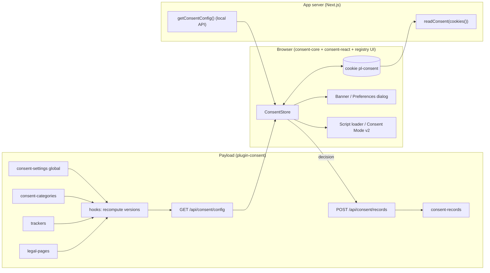

# Consent plugin for Payload — technical specification

| | |
| --- | --- |
| Working name | `@payload-solutions/plugin-consent` (product name pending the Payload trademark answer; do not use "Payload Consent" publicly until then) |
| Status | Draft v0.1 for review, 5 September 2026 |
| Scope | Payload 3.x plugin + framework-agnostic client core + React/Next.js bindings + shadcn registry UI |
| Related | `notes/V1-SCOPE.md` items 13–16; PolicyStack / c15t / Consentify evaluation (conversation notes, 2026-09-05) |
| License | MIT (code); seeded legal text CC0 (General Legal) and CC BY 4.0 (Common Paper) with attribution kept in the seed |

> This plugin produces legal-adjacent output. Every surface (README, admin, docs, seeded pages) carries: "This software helps you publish and enforce your privacy choices. It is not legal advice; have your documents reviewed for your jurisdiction."

---

## 1. Summary

One source of truth in the Payload admin — categories, trackers (scripts and cookies), legal documents — drives three things that today drift apart in every project: the consent banner, the gating of the scripts the banner talks about, and the "cookies we use" table inside the cookie policy. Decisions are recorded as immutable, minimal consent records in Payload, giving the audit trail that hosted CMPs sell as their cloud tier. Server code (Next.js Server Components, route handlers, middleware) can read the visitor's consent without a round trip, and any frontend (React, Astro, plain HTML) can consume the same configuration over one public endpoint.

What it deliberately is not: an IAB TCF CMP, a legal-advice engine, or a site scanner (scanner is a later, separate CLI).

## 2. Goals and non-goals

Goals

1. Editors, not developers, maintain the list of cookies/scripts and their categorisation; the cookie policy table and the banner categories are generated from it and cannot disagree.
2. Correct default behaviour by jurisdiction: opt-in (EEA, UK, CH, BR), opt-out with GPC honoured (US states), notice-only or none elsewhere; unknown → opt-in.
3. Consent is enforceable server-side: a compact cookie readable in RSC/middleware, plus a typed client store for the browser.
4. Google Consent Mode v2 signals derived from categories, so `google` analytics/ads can be offered legally in the EEA/UK.
5. Re-consent when the policy materially changes (documents, categories, trackers, expiry), with the previous decisions retained as defaults.
6. Consent records in Payload: immutable, minimal (no IP), queryable, retention-purged, optionally linked to a logged-in user.
7. Works in any Payload 3 project; first-class integration with Payload Stack (`stack.config.ts`, Better Auth users, analytics adapter).
8. UI is owned by the user: a shadcn registry item copied into the project, not a styled dependency. Headless hooks underneath.

Non-goals (v1)

- IAB TCF 2.x, Google's "certified CMP" listing, per-vendor consent.
- Auto-discovery of cookies by crawling (v0.3 scanner CLI), or by build-time source scanning.
- Multi-site / per-tenant consent settings (see §17; designed to be possible, not built).
- Generating the privacy policy from a data-processing model (PolicyStack's approach). Documents are seeded text, edited in the admin; only the cookie table is generated.
- Server-set consent cookies for no-JS flows (banner requires JS; without JS nothing non-essential loads, which is the safe outcome).

## 3. Architecture



Data flow, one page view:

1. Server renders the page. In Next.js the layout calls `getConsentConfig(payload, locale)` (local API, request-cached) and `readConsent(cookies())`, passes both to `<ConsentProvider>` — no fetch, no flash, no hydration mismatch.
2. The store resolves initial state: cookie present and current → decided; missing → undecided under the resolved jurisdiction's model; present but stale/expired → `reprompt` with previous decisions as defaults.
3. Trackers whose category is granted load; Google tags load immediately with Consent Mode defaults derived from state.
4. When the visitor decides, the store writes the cookie, updates Consent Mode, loads newly granted scripts, emits `consentchange`, and POSTs a record (if recording is enabled).

## 4. Packages and distribution

| Package | Kind | Contents |
| --- | --- | --- |
| `@payload-solutions/plugin-consent` | npm, Payload plugin | collections, global, endpoints, hooks, versions, seeds, Payload Jobs task for retention, admin components (`./client`), server helpers (`./server`: `getConsentConfig`, `readConsent`, `CookieTable` RSC), Lexical `CookieTableBlock` |
| `@payload-solutions/consent-core` | npm, framework-agnostic, zero deps, target < 5 kB gzip | store/state machine, cookie codec, jurisdiction resolution, Consent Mode v2 bridge, GPC, script loader, cross-tab sync |
| `@payload-solutions/consent-react` | npm, peer `react >=18` | `ConsentProvider`, hooks, `ConsentGate`, `ConsentScripts`, `ConsentModeScript`; `./next` sub-path with `readConsent(cookies())` |
| `consent-banner` | shadcn registry item at `https://payload.solutions/r/consent-banner.json` | `components/consent/banner.tsx`, `preferences-dialog.tsx`, `reload-notice.tsx`, built on the project's Button/Dialog/Switch/Accordion; copied into the project |
| `@payload-solutions/consent-embed` (v0.2) | npm + served at `/api/consent/embed.js` | vanilla banner for non-React frontends, templated from the config endpoint |

Decision on the client core (refines the earlier advice to "wrap an existing core"): the plugin owns the cookie format and the record contract, because server-side reading and audit records depend on them. The state machine itself is ~300 lines; carrying c15t (111 releases in 18 months) or Consentify (single author) as a dependency for that would add churn without adding capability. `consent-core` is written in-house, using Consentify (MIT) and PolicyStack core (Apache-2.0) as reference implementations for the Consent Mode and GPC edges. The parts worth borrowing from c15t are its 25 script snippets; those become `trackers` seed presets, not code.

Payload Stack sequencing: Stack v1 ships the banner, cookie format, category keys and config shape defined here as in-repo code (`src/consent/*`). Extraction to the packages above is a move, not a rewrite.

## 5. Data model

All slugs are configurable via plugin options; defaults shown. Text fields are `localized: true` when the host project has `localization` configured (the plugin checks `config.localization` at init).

### 5.1 Global `consent-settings`

| Field | Type | Notes |
| --- | --- | --- |
| `enabled` | checkbox, default true | Master switch. Off → config endpoint returns `{ enabled: false }`, provider renders nothing, all trackers treated as blocked except `necessary`. |
| `jurisdiction.resolution` | select: `header` \| `manual` \| `none` | `header` reads `cf-ipcountry`, `x-vercel-ip-country`, `x-country` (configurable list); `manual` uses `jurisdiction.fixed`; `none` → `jurisdiction.fallback`. |
| `jurisdiction.fixed` | text (ISO 3166-1 alpha-2 or `EEA`) | Used with `manual`. |
| `jurisdiction.fallback` | select: `opt-in` \| `opt-out` \| `notice` \| `none`, default `opt-in` | Model when the country is unknown. |
| `jurisdiction.overrides` | array `{ region, model }` | Region = country code, `EEA`, or `US-CA` style state code. Defaults seeded from §7. |
| `reconsent.on` | select hasMany: `documents` \| `categories` \| `trackers`, default `[documents, categories]` | Which version components force a re-prompt. |
| `reconsent.expiresAfterMonths` | number, default 6 | CNIL guidance is 6 months; ICO/AEPD allow up to 12–13. |
| `banner.*` | group, localized | `title`, `description`, `acceptAllLabel`, `rejectAllLabel`, `customizeLabel`, `saveLabel`, `position` (`bottom` \| `bottom-left` \| `bottom-right` \| `center`), `privacyPage` and `cookiePage` (relationship → legal-pages). |
| `banner.showRejectAll` | checkbox, default true, admin note | Hard-locked true when any opt-in jurisdiction is active (EDPB 05/2020 §§ 39–41: refusing must be as easy as accepting). |
| `recording.mode` | select: `none` \| `anonymous` \| `linked`, default `anonymous` | `linked` additionally stores the relationship to `req.user`. |
| `recording.retentionMonths` | number, default 36 | Retention job purges older records. |
| `recording.implicit` | checkbox, default false | Also record dismissals under `notice`/`none` models (source `implicit`). |
| `recording.userAgent` | checkbox, default false | Store the coarse browser family on records. |
| `consentMode.enabled` | checkbox, default auto (true when any tracker has `consentModeManaged`) | Emits `gtag('consent', …)` defaults/updates. |
| `consentMode.adsDataRedaction`, `consentMode.urlPassthrough` | checkbox | Passed through to gtag. |
| `versions` | group, read-only (admin `readOnly`, `hidden: false`) | `policyVersion`, `categoriesVersion`, `trackersVersion`, `documentsVersion`, `bumpedAt`. Maintained by hooks (§6). |

### 5.2 Collection `consent-categories`

| Field | Type | Notes |
| --- | --- | --- |
| `key` | text, unique, index, slug-validated | Stable identifier in cookie and records (`necessary`, `functional`, `analytics`, `marketing`, custom). |
| `label`, `description` | text / textarea, localized | Shown in the preferences dialog and the cookie policy. |
| `required` | checkbox | Locked on; cannot be refused; not stored as a decision. Exactly one category may be `required` by default (`necessary`). |
| `order` | number | Display order. |
| `respectGPC` | checkbox, default true for non-required | In opt-out jurisdictions, GPC forces this category to `false`. |
| `consentModeSignals` | select hasMany | Subset of `analytics_storage`, `ad_storage`, `ad_user_data`, `ad_personalization`, `functionality_storage`, `personalization_storage`, `security_storage`. Defaults in §10.5. |
| `defaultInOptOut` | checkbox, default true | Granted by default under the opt-out model until refused. |

Access: read `anyone` (needed by the config endpoint and the React tree), write admin. Deleting a category with trackers attached is blocked by a `beforeDelete` hook.

### 5.3 Collection `trackers` (admin label "Cookies & scripts")

| Field | Type | Notes |
| --- | --- | --- |
| `name` | text | e.g. "PostHog", "Google Analytics 4", "YouTube embeds". |
| `vendor`, `vendorPrivacyUrl` | text | Disclosure. |
| `category` | relationship → consent-categories, required | Drives gating. |
| `kind` | select: `script` \| `cookie-only` \| `pixel` \| `iframe` \| `sdk` | `sdk` = loaded by app code that asks the store (`useCategory`) rather than by the loader. |
| `purpose` | textarea, localized | Disclosure row. |
| `cookies` | array `{ name, domain, durationText, storage: cookie \| localStorage \| sessionStorage \| indexedDB, description }` | Rows for the cookie table. |
| `loader` | group, shown when kind = script/pixel | `src`, `inlineCode` (code), `strategy` (`afterDecision` \| `lazy`), `attributes` (json), `consentModeManaged` (checkbox: load immediately, gated by Consent Mode rather than by omission — Google tags only), `nonceRequired` (checkbox). |
| `enabled` | checkbox, default true | |
| `environments` | select hasMany: `development` \| `production`, default both | Filtered by `NODE_ENV` in the config endpoint. |
| `presetKey` | text, hidden | Set when created from a preset (see seeds) so updates can target it. |

Access: read `anyone` for public fields (a `select` projection in the endpoint strips `inlineCode` unless the tracker is enabled and served; nothing secret is stored here), write admin.

### 5.4 Collection `consent-records`

| Field | Type | Notes |
| --- | --- | --- |
| `consentId` | text, index | UUID v4 generated client-side, kept in the cookie. Rotates when the visitor withdraws everything. |
| `user` | relationship → users collection (option `usersSlug`), optional, index | Only in `linked` mode and only when `req.user` exists. |
| `decisions` | json | `{ [categoryKey]: boolean }` for non-required categories. |
| `grantedCategories` | select hasMany of category keys | Flattened copy of `decisions` for counting/filtering in the admin. |
| `versions` | group | `policyVersion`, `categoriesVersion`, `trackersVersion`, `documentsVersion` at decision time. |
| `jurisdiction` | group | `country` (from header), `model` applied. No IP. |
| `locale` | text | Banner language shown. |
| `source` | select: `banner` \| `preferences` \| `api` \| `gpc` \| `withdraw` \| `implicit` | `implicit` only under `notice`/`none` models, and only if `recording.implicit` is on (default off). |
| `userAgentFamily` | text, optional | Coarse family only ("Chrome", "Safari"), derived server-side; opt-in via `recording.userAgent`. |
| `expiresAt` | date | decidedAt + expiresAfterMonths. |

Access: create via endpoint only (the collection's own REST create is disabled by `access.create: () => false`; the endpoint uses `overrideAccess`), read admin, update/delete `false` (retention job runs with `overrideAccess`). `timestamps: true` supplies `createdAt` = decidedAt. Excluded from multi-tenant scoping.

### 5.5 Collection `legal-pages` (optional, `legalPages: true`)

Same shape as Payload Stack's collection today, plus:

| Field | Type | Notes |
| --- | --- | --- |
| `kind` | select: `privacy` \| `terms` \| `cookies` \| `dpa` \| `other` | Lets the plugin find the pages the banner links to and the document that carries the cookie table. |
| `effectiveDate` | date, required | Participates in `documentsVersion` (§6). |
| `content` | richText (Lexical) | Editor gets `BlocksFeature({ blocks: [CookieTableBlock, PolicyVersionBlock] })`. `CookieTableBlock` renders the trackers grouped by category at render time (RSC converter provided; HTML converter for non-React). |
| `versions.drafts` | on | Only published documents count toward versions. |

## 6. Policy versioning

Three component hashes (8-hex of SHA-256 over a canonical JSON) and one composite:

- `categoriesVersion` = sorted `{ key, required }` of enabled categories.
- `trackersVersion` = sorted `{ id, categoryKey, kind }` of enabled trackers.
- `documentsVersion` = sorted `{ kind, effectiveDate }` of published legal pages with kind `privacy` or `cookies`.
- `policyVersion` = hash of the three.

Recomputed in `afterChange`/`afterDelete` hooks of the three collections (debounced within a request via `req.context`) and written to `consent-settings.versions`. Adding a tracker inside an already-granted category changes `trackersVersion` only; whether that re-prompts is the editor's choice (`reconsent.on`). The cookie stores all three, so the client can tell which component changed and the banner can say why ("We added a new analytics tool").

## 7. Jurisdictions and consent models

| Model | Behaviour before a decision | Banner | GPC |
| --- | --- | --- | --- |
| `opt-in` | all non-required categories denied | shown; Accept all / Reject all / Customize with equal prominence; no pre-ticked toggles | irrelevant (already denied), still recorded as source `gpc` if it forced state |
| `opt-out` | non-required categories granted unless `defaultInOptOut` false | shown as notice with "Do not sell or share" → preferences; dismissable | categories with `respectGPC` forced to denied; record source `gpc` |
| `notice` | granted | small dismissable notice, no toggles required | honoured for `respectGPC` categories |
| `none` | granted | nothing rendered | honoured for `respectGPC` categories |

Seeded overrides: EU-27 + IS/LI/NO + GB + CH + BR → `opt-in`; US + all US state codes → `opt-out`; CA → `opt-in` (PIPEDA implied consent is arguable; the safe default is chosen); everything else → `fallback`. The header country is mapped to a model server-side and included in the config response so the client never ships the table.

Resolution order: query override `?consent_jurisdiction=` in development only → configured header → fixed → fallback.

## 8. Endpoints

Registered with `config.endpoints` (root level, `PayloadHandler` signature), under a configurable base path, default `/consent`, so they appear at `/api/consent/*`. CORS via `headersWithCors`; `allowedOrigins` option for headless frontends.

### `GET /api/consent/config?locale=xx`

Public. Returns the everything-the-client-needs document:

```ts
type ConsentConfig = {
  enabled: boolean
  versions: { policyVersion: string; categoriesVersion: string; trackersVersion: string; documentsVersion: string }
  jurisdiction: { country: string | null; model: 'opt-in' | 'opt-out' | 'notice' | 'none' }
  categories: Array<{ key: string; label: string; description: string; required: boolean; respectGPC: boolean; defaultInOptOut: boolean; consentModeSignals: string[] }>
  trackers: Array<{ id: string; name: string; categoryKey: string; kind: string; loader?: { src?: string; inline?: string; strategy: string; attributes?: Record<string, string>; consentModeManaged: boolean } }>
  banner: { title: string; description: string; labels: {...}; position: string; links: { privacy?: string; cookies?: string } }
  reconsent: { on: string[]; expiresAfterMonths: number }
  recording: { enabled: boolean }
  consentMode: { enabled: boolean; adsDataRedaction: boolean; urlPassthrough: boolean }
  cookie: { name: string; maxAgeDays: number; domain?: string }
}
```

Headers: `Cache-Control: public, max-age=60, s-maxage=300, stale-while-revalidate=86400`, `ETag: "<policyVersion>:<locale>:<model>"`, `Vary: Accept-Language, cf-ipcountry, x-vercel-ip-country`. Because the jurisdiction depends on request headers, CDN caching keys must include the country header; the Next.js path avoids the problem entirely by calling the local API.

### `POST /api/consent/records`

Body (zod-validated, ≤ 4 kB):

```ts
{ consentId: string /* uuid */; decisions: Record<string, boolean>; versions: {...}; source: 'banner'|'preferences'|'api'|'gpc'|'withdraw'; locale?: string }
```

Server adds `jurisdiction`, `user` (if `linked` and `req.user`), `expiresAt`, strips unknown category keys, rejects if `recording.mode === 'none'` (204) or if `versions.policyVersion` is unknown (409 — client refetches config). Rate limit: token bucket per client IP (first trusted hop from `x-forwarded-for`, configurable `trustProxy`), default 20/min, in-memory with LRU; documented as best-effort on serverless, with a hook for platform rate limiting. Response 201 `{ id }`.

### `GET /api/consent/records/me`

Authenticated. Returns the caller's linked records (newest first, max 50) for an account "Privacy" page and for data-subject access requests.

### `GET /api/consent/embed.js` (v0.2)

Serves `consent-embed` with the config inlined for non-React sites.

## 9. Cookie and record format

Cookie name default `pl-consent` (option `cookie.name`), `Path=/`, `SameSite=Lax`, `Secure` on https, **not** `HttpOnly` (the client store must read it), `Max-Age` = expiresAfterMonths, optional `Domain` for cross-subdomain sites. Payload is base64url JSON, ~180 bytes:

```ts
type ConsentCookieV1 = {
  v: 1
  id: string            // consentId
  d: Record<string, 0 | 1>  // decisions for non-required categories
  t: number             // decidedAt, unix seconds
  pv: string; cv: string; tv: string; dv: string
  j: string             // model applied: 'in' | 'out' | 'notice' | 'none'
  s: 'b' | 'p' | 'a' | 'g' | 'w' | 'i'  // source: banner, preferences, api, gpc, withdraw, implicit
}
```

Not signed: the cookie is the visitor's own statement of preference, and the server treats a malformed or unknown-version cookie as "undecided" (which denies everything non-required). Server reader:

```ts
import { readConsent } from '@payload-solutions/consent-react/next'
const consent = readConsent(await cookies(), config)   // { status: 'decided'|'undecided'|'stale', has(key), decisions }
if (consent.has('analytics')) { /* server-side capture */ }
```

## 10. Client runtime (`consent-core`)

### 10.1 Store

```ts
type ConsentStatus = 'undecided' | 'decided' | 'stale'
type ConsentState = {
  status: ConsentStatus
  model: 'opt-in' | 'opt-out' | 'notice' | 'none'
  decisions: Record<string, boolean>         // effective, non-required categories
  draft: Record<string, boolean>             // preferences dialog working copy
  ui: 'banner' | 'preferences' | 'closed'
  repromptReason: null | 'expired' | 'documents' | 'categories' | 'trackers'
  gpc: boolean
  needsReload: boolean                        // a granted script was revoked
}
type ConsentStore = {
  getState(): ConsentState
  subscribe(fn: (s: ConsentState) => void): () => void
  has(expr: string | { and: Expr[] } | { or: Expr[] } | { not: Expr }): boolean
  acceptAll(): void; rejectAll(): void; withdraw(): void
  toggle(key: string, value?: boolean): void; save(): void
  open(ui: 'banner' | 'preferences'): void; close(): void
  onChange(fn: (decisions, prev) => void): () => void
}
```

`createConsentStore({ config, initialCookie?, storage?, now? })`. Storage adapter interface `{ read(): string | null; write(value, maxAgeDays): void; clear(): void }` with `cookieStorage` default and `memoryStorage` for tests/SSR. No dependencies; `useSyncExternalStore`-compatible.

### 10.2 Initial resolution

```
cookie = storage.read()
if !cookie or cookie.v != 1                  → undecided (model defaults)
else if expired(cookie.t)                    → stale('expired'), draft = cookie.d
else if reconsent.on includes changed part   → stale(<part>), draft = cookie.d
else                                          → decided, decisions = cookie.d (unknown keys dropped, new keys = model default)
if model == 'opt-out' and gpc                → force respectGPC categories false (source 'gpc' if it changed anything)
ui = undecided|stale ? (model in [in, out, notice] ? 'banner' : 'closed') : 'closed'
```

Under `notice` and `none`, "undecided" still means granted per §7; the banner (if any) is informational and dismissing it writes a cookie with source `implicit` (not recorded unless enabled).

### 10.3 Decisions

`acceptAll`/`rejectAll`/`save` → compute decisions → `storage.write(encode(...))` → `status = decided`, `ui = closed` → `onChange` listeners → Consent Mode `update` → script loader pass → record POST (fire-and-forget, `keepalive: true`) → `window.dispatchEvent(new CustomEvent('consentchange', { detail }))`. `withdraw()` = all false + new `consentId` + source `w`.

### 10.4 Script loader

For each tracker with a `loader` and category granted (or `consentModeManaged`): inject once (`data-consent-tracker=<id>` idempotency), `async`, attributes applied, `nonce` from `config.nonce` if provided. Revocation cannot unload; the store sets `needsReload` and the registry UI shows a one-line "Reload to apply" notice — honest rather than pretending. `kind: 'iframe'` trackers are not injected; they are handled by `<ConsentGate>` placeholders in the app (YouTube pattern).

### 10.5 Google Consent Mode v2

Before any Google tag executes, `<ConsentModeScript>` (inline, nonce-aware) emits:

```js
window.dataLayer = window.dataLayer || []; function gtag(){dataLayer.push(arguments)}
gtag('consent', 'default', { analytics_storage: 'denied', ad_storage: 'denied', ad_user_data: 'denied', ad_personalization: 'denied', functionality_storage: 'denied', personalization_storage: 'denied', security_storage: 'granted', wait_for_update: 500 })
```

The default values are derived from the *resolved initial state* (so an opt-out visitor with no GPC gets `granted` for the mapped signals), and every decision issues `gtag('consent', 'update', …)` mapped through `category.consentModeSignals`. Default mapping seeded: `necessary → security_storage`, `functional → functionality_storage, personalization_storage`, `analytics → analytics_storage`, `marketing → ad_storage, ad_user_data, ad_personalization`. `ads_data_redaction` and `url_passthrough` set from settings.

### 10.6 GPC and cross-tab

`navigator.globalPrivacyControl === true` handled as in §7. Cross-tab: a mirror key in `localStorage` (`pl-consent:sync`) written on every decision; the `storage` event re-reads the cookie in other tabs. `cookieStore.addEventListener('change')` used when available.

## 11. React and Next.js (`consent-react`)

```tsx
// app/layout.tsx (Server Component)
import { getConsentConfig } from '@payload-solutions/plugin-consent/server'
import { ConsentProvider, ConsentScripts, ConsentModeScript } from '@payload-solutions/consent-react'
import { ConsentBanner } from '@/components/consent/banner'   // registry item

const payload = await getPayload({ config })
const consent = await getConsentConfig(payload, { locale, headers: await headers() })
const cookie = (await cookies()).get(consent.cookie.name)?.value

<ConsentProvider config={consent} initialCookie={cookie}>
  <ConsentModeScript nonce={nonce} />
  {children}
  <ConsentScripts />
  <ConsentBanner />
</ConsentProvider>
```

Hooks: `useConsent()` (state + actions), `useCategory(key)` → `{ granted, required, toggle }`, `useConsentStatus()`, `useHasConsent(expr)`. Components: `<ConsentGate category="marketing" fallback={<Placeholder onAccept />}>`, `<ConsentScripts />` (mounts the loader; renders nothing), `<ConsentModeScript />`. `ConsentProvider` is a client component; it accepts the server-read cookie so the first client render equals the server render.

Non-Next React (Vite, Remix): `ConsentProvider` with `configUrl="/api/consent/config"` fetches instead; a `fallbackModel` prop prevents flashing scripts before config arrives (default `opt-in`).

Registry UI (`consent-banner`): banner region (`role="region" aria-label="Cookie consent"`, non-modal, does not trap focus, never covers the whole page — cookie walls are not valid consent), Accept all / Reject all as sibling `Button`s with identical variant, "Customize" opens `Dialog` (modal, focus-trapped, ESC closes, toggles are `Switch`es defaulting to current decisions, required category shown locked, per-category tracker list in `Accordion`), "Save preferences". Renders category and tracker texts from config; no hard-coded copy. `<ReloadNotice />` for `needsReload`. A `<ManageConsentButton />` for the footer ("Cookie settings") satisfies "withdrawal as easy as consent" (GDPR Art. 7(3)).

## 12. Legal pages, cookie table, seeds

`CookieTableBlock` (Lexical block, `slug: 'cookieTable'`, fields: `groupBy: category | vendor`, `showDurations`) is rendered by:

- RSC converter: `<CookieTable trackers categories locale />` (server component from `./server`) → table per category with name, vendor, purpose, cookies (name, duration, storage).
- HTML converter for `convertLexicalToHTML` users (Astro/email).

`PolicyVersionBlock` renders "Version {documentsVersion}, effective {date}" for the page.

Seeds (`seed: true | { company, jurisdictions, locale }` on init, idempotent, skipped when collections are non-empty):

- Categories: the four defaults with labels/descriptions in `en` (+ `de`, `fr`, `es`, `nl`, `pl`, `hr` dictionaries as they are contributed).
- Trackers: presets library (`presets/*.ts`) — PostHog (EU/US), GA4, GTM, Meta Pixel, LinkedIn Insight, Hotjar, Clarity, Intercom, Crisp, YouTube, Vimeo, Google Maps, Stripe.js (necessary), Vercel Analytics (cookieless: declared, category analytics, no cookies), Umami/Plausible (cookieless). A preset supplies vendor, purpose, cookie rows, loader template with placeholders (`{{measurementId}}`), and default category. Seeding creates only the presets named in options (`seedTrackers: ['posthog']`).
- Legal pages: Privacy Policy (GDPR-enhanced) and Cookie Notice from General Legal (CC0), Terms of Service from Common Paper (CC BY 4.0, B2B) with the attribution line kept, `<mark>` fields substituted from `company` (`legalName`, `address`, `email`, `url`, `jurisdictions`, `dpo?`); Markdown → Lexical via `convertMarkdownToLexical`; the cookie policy gets a `cookieTable` block in place of the static cookie list. Fields the seed cannot fill remain highlighted (`<mark>` → a `highlight` text format) so editors see what to review.

## 13. Admin UX

- Group "Privacy" in the nav: Settings (global), Categories, Cookies & scripts, Legal pages, Consent records.
- Consent records: list view read-only, default columns createdAt, source, jurisdiction.country, grantedCategories, user; filters on the same; no edit/delete buttons (access false); CSV export via Payload's export if enabled.
- `beforeDashboard` widget (`./client` → server component): current policy version and when it bumped, 30-day counts per category (`payload.count` with `grantedCategories contains`), records total, "N enabled trackers, M with cookies declared", warnings: opt-in jurisdiction active with `showRejectAll` false (cannot happen — locked, shown for clarity), trackers without a `vendorPrivacyUrl`, category with zero trackers.
- Settings global "Preview banner" button (v0.2): opens the site with `?consent_preview=1` which forces `undecided`.

## 14. Payload Stack integration

`stack.config.ts`:

```ts
privacy: {
  consent: 'auto',                 // 'auto' = enabled when any consent-gated tracker exists; true | false
  recording: 'linked',             // none | anonymous | linked (Better Auth users)
  cookieName: 'pl-consent',
},
analytics: { provider: 'posthog', region: 'eu', cookieless: 'on_reject' },   // | 'google' | 'none'
legal: { company: 'Example Software Ltd', legalName: 'Example Software Ltd', address: '…', jurisdictions: ['eea', 'uk'], email: 'privacy@example.com', dpo: false },
```

`payload.config.ts` adds `consentPlugin({ usersSlug: 'users', legalPages: true, seed: { company: stack.legal, trackers: fromAnalytics(stack.analytics) }, jurisdictions: … })`. The analytics adapter registers its tracker preset (`posthog` or `ga4`) and, for PostHog, uses `kind: 'sdk'`: the adapter calls `posthog.init` with `cookieless_mode: 'on_reject'`/`opt_out_capturing_by_default` and calls `opt_in_capturing()` from `store.onChange` when `analytics` is granted — the plugin gates, PostHog's own persistence follows. GA4 uses `consentModeManaged: true`. With `provider: 'none'` there are no consent-gated trackers, `consent: 'auto'` resolves to disabled, and no banner is rendered — the privacy-by-default story.

Account → Privacy tab (better-auth-ui `settings` custom card): consent history from `/api/consent/records/me`, "Manage cookie preferences" (opens the dialog), "Withdraw all", plus the JSON account export from V1-SCOPE item 16. `consent-records` is not tenant-scoped; the multi-tenant bridge is untouched.

## 15. Non-React frontends (v0.2)

`consent-embed`: `<script src="/api/consent/embed.js" defer>` renders a minimal accessible banner/dialog from `banner.*` texts with CSS variables for theming, uses `consent-core` internally, honours the same cookie, so an Astro or plain HTML marketing site and the Next.js app on the same apex domain share one decision (`cookie.domain`).

## 16. Security, privacy and compliance checklist

- Data minimisation: no IP, no full user agent, no fingerprinting; `consentId` is random and rotates on withdrawal; records carry only what proves the decision (EDPB 05/2020 § 104–107 on demonstrating consent).
- Records immutable; retention purge via Payload Jobs task `consent-purge-records` (daily, default 36 months; the first natural consumer of Payload Clock on serverless).
- Endpoint hardening: zod schemas, 4 kB body cap, rate limit, CORS allow-list, `Cache-Control: no-store` on POST and `/me`, unknown category keys dropped, version mismatch → 409.
- No `dangerouslySetInnerHTML` of editor content in the banner; texts rendered as text. Tracker `inlineCode` is admin-authored and executes on the site by design — admin write access is the trust boundary, called out in the docs.
- CSP: all inline emissions accept `nonce`; loader marks scripts with the same nonce.
- Accessibility: WCAG 2.2 AA for banner and dialog (focus order, ESC, labels, contrast via shadcn tokens, no auto-dismiss timers).
- Legal defaults encoded: no pre-ticked toggles; reject as prominent as accept; no cookie wall; withdrawal one click from the footer; re-consent ≤ 6 months by default; GPC honoured in opt-out regions (CPRA § 7025).
- Disclaimer everywhere (see header).

## 17. Compatibility and constraints

- Payload `^3.79 <4` initially (matches payload-auth); Payload 4 once Stack moves. Uses only public config surface: collections, globals, endpoints (`PayloadHandler`), hooks, `onInit`, `jobs.tasks`, `admin.components.beforeDashboard`, Lexical `BlocksFeature`, `convertMarkdownToLexical`.
- Databases: Postgres, SQLite, Mongo (json fields only; no DB-specific queries; `grantedCategories` as `select hasMany` keeps counting portable).
- Multi-tenant plugin: plugin collections are not added to the tenant list; a future `scope: 'tenant'` option would add a `tenant` relationship to settings/categories/trackers and key the config endpoint by host.
- Localization: piggybacks on the host's `localization`; without it, single-language.
- Next 15/16 App Router for the `./next` helpers; React ≥ 18 peer; no Next dependency in `consent-react` core.

## 18. Testing

- `consent-core` (vitest): state resolution matrix (model × cookie state × GPC), codec round-trip and corruption, reprompt reasons, Consent Mode mapping and default/update ordering, loader idempotency, expression evaluator.
- Plugin (vitest + Payload with `@payloadcms/db-sqlite` in-memory): version hooks bump the right component, endpoint validation and 409, access rules (records not readable anonymously, not creatable via REST), seeds idempotent, retention task purges only expired.
- Playwright (in Payload Stack): EEA header → banner with Reject all, script absent until accept, present after; `none` model → no banner, scripts present; GPC + US-CA → analytics denied and recorded as `gpc`; version bump → reprompt with previous defaults; footer "Cookie settings" reopens dialog; axe scan of banner and dialog.
- Contract test: `ConsentConfig` zod schema shared between server and client packages; a snapshot of `/api/consent/config` per model.

## 19. Plugin options

```ts
export type ConsentPluginOptions = {
  enabled?: boolean
  basePath?: string                          // '/consent'
  slugs?: { settings?: string; categories?: string; trackers?: string; records?: string; legalPages?: string }
  usersSlug?: string | false                 // for linked records; false disables linking
  legalPages?: boolean | { seed?: boolean }
  cookie?: { name?: string; domain?: string; sameSite?: 'lax' | 'strict' }
  jurisdiction?: { headers?: string[]; overrides?: Array<{ region: string; model: Model }>; fallback?: Model; trustProxy?: boolean }
  recording?: { mode?: 'none' | 'anonymous' | 'linked'; retentionMonths?: number; rateLimitPerMinute?: number; implicit?: boolean; userAgent?: boolean }
  allowedOrigins?: string[]
  seed?: false | { company: CompanyInfo; locale?: string; categories?: boolean; trackers?: PresetKey[] | Array<Partial<Tracker>>; legalPages?: boolean }
  admin?: { dashboardWidget?: boolean; group?: string }
  jobs?: { purge?: boolean | { cron?: string } }
}
```

## 20. Milestones

| Milestone | Content | Estimate (solo) |
| --- | --- | --- |
| M1 | `consent-core`: store, codec, jurisdiction, Consent Mode, GPC, loader, tests | 3–4 days |
| M2 | Plugin: collections/global, version hooks, config + records endpoints, access, seeds (categories, presets) | 3–4 days |
| M3 | `consent-react` + registry banner/dialog + Next helpers; a11y pass | 2–3 days |
| M4 | Legal pages in plugin, `CookieTableBlock`, template seeds (Common Paper / General Legal) with substitution | 2–3 days |
| M5 | Payload Stack integration (`stack.config` keys, analytics adapter, account Privacy tab), dashboard widget, docs, e2e | 3 days |
| v0.2 | embed script, banner preview, retention job wiring to Payload Clock | later |
| v0.3 | scanner CLI (Playwright crawl → diff discovered cookies vs declared) | later |

About three weeks to a publishable 0.1, assuming Stack v1 ships the in-repo minimal version first (V1-SCOPE 13–15) and M1–M5 is the extraction plus generalisation.

## 21. Open decisions

1. Name and product framing under payload.solutions (depends on the trademark answer).
2. `recording.mode` default: `anonymous` (proposed) vs `none` (lightest) for the generic plugin; Payload Stack sets `linked`.
3. Legal pages inside this plugin (proposed, behind `legalPages`) vs a separate `plugin-legal`. Inside keeps the cookie table and document versioning in one place.
4. Whether to vendor Consentify's Consent Mode/GPC code (MIT, attribution) or write from the Google/CPRA specs directly. Proposed: write, test against Google's Tag Assistant.
5. Seeded terms: Common Paper (B2B, CC BY) as the default, or General Legal Terms of Use (CC0, broader) — or both with `company.audience: 'b2b' | 'b2c'` choosing.
6. Registry hosting: `payload.solutions/r/*.json` built from `packages/registry` in the monorepo (same pipeline as better-auth-ui uses).

## 22. References

- EDPB Guidelines 05/2020 on consent; GDPR Art. 4(11), 7; ePrivacy Directive Art. 5(3); CNIL cookie guidelines (reject-as-easy-as-accept, 6-month renewal); ICO cookies guidance; CPRA regulations § 7025 (GPC).
- Google Consent Mode v2 developer docs (signals, `wait_for_update`, `ads_data_redaction`, `url_passthrough`).
- Payload 3.88 config types: `Plugin`, `Endpoint`/`PayloadHandler`, `onInit`, `admin.components.beforeDashboard`, `jobs`; `@payloadcms/richtext-lexical`: `BlocksFeature`, `convertMarkdownToLexical`, `convertHTMLToLexical`, `EXPERIMENTAL_TableFeature`.
- Reference implementations reviewed 2026-09-05: PolicyStack (`@policystack/core/consent`), c15t, Consentify, OpenConsent; template sources: General Legal `legal-templates` (CC0), Common Paper ToS v2.1 (CC BY 4.0).
