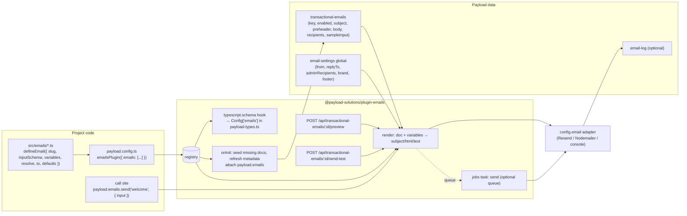

# Emails plugin for Payload — technical specification

| | |
| --- | --- |
| Working name | `@payload-solutions/plugin-emails` (product name "Payload Emails" pending the Payload trademark answer; same rule as the consent plugin) |
| Status | Draft v0.1 for review, 6 September 2026 |
| Scope | Payload 3.x plugin: code-defined transactional emails, admin-editable copy, typed send API, preview/test, optional queue and log |
| Reference implementation | Klick17 `k17-200-products` email framework (`includes/classes/emails/framework/*`, PHP/WordPress) |
| Related | `docs/plugins/payload-emails.mdx` (public stub), `templates/payload-stack/src/emails/*` (pipeline this plugin replaces), `notes/plugin-consent-spec.md` (format precedent) |
| Verified against | Payload `v3.88.0` source (`packages/payload/src`, `packages/richtext-lexical/src`, `packages/plugin-ecommerce/src`); a proof of concept of the type generation ran against the real `generateTypes` (§6.3) |
| License | MIT |

---

## 1. Summary

A transactional email is declared once, in code, as a small typed object: its key, the input the caller must pass, the variables editors may use, how input becomes variables, and default copy. The plugin keeps one Payload document per declared email in a `transactional-emails` collection where non-developers edit the subject, preheader and body (Lexical rich text with `{{variables}}`), switch the email on or off, and preview or test-send it with sample data. Application code sends with one typed call — `payload.emails.send('welcome', { input: { user, url } })` — and the plugin renders the current copy into a branded layout and hands it to whatever email adapter the project already configured (Resend, Nodemailer, console).

The connection between code and database is explicit and one-directional: code owns *what an email is* (key, inputs, variables, recipient logic, defaults); the database owns *what it says* (copy, enabled flag, admin-editable recipients). Nothing an editor writes is overwritten by a deploy; nothing a developer declares can drift from what the admin shows, because the admin reads the declaration itself. Type generation hooks into `payload generate:types` so every email key, its input and its variables are part of `payload-types.ts`, the same way Payload types jobs tasks.

This is the Klick17 `K7P_Email` model rebuilt on Payload primitives: collections, versions, localization, Lexical, the email adapter, jobs and the type generator, instead of a bespoke table, `wp_mail` and a hand-rolled options page.

## 2. What is being ported from Klick17

The PHP framework has the right shape; the plugin keeps the model and swaps every mechanism for a Payload-native one.

| Klick17 (`K7P_Email` framework) | Plugin equivalent | Notes |
| --- | --- | --- |
| `abstract class K7P_Email` subclass per email; `$code` = class name | `defineEmail({ slug, … })` object; `slug` is the key | Objects, not classes; registered through the plugin option, not by include order. |
| `$description`, `$event`, `$domain` | `label`, `description`, `trigger`, `group` | Shown read-only in the admin; stored copies are refreshed from code (§8). |
| `$variables` (list of `[var]` tokens) | `variables` manifest (`{{dotted.path}}` with description, example, type) | Manifest drives editor chips, validation and generated types. |
| `map_variables(...$args)` positional args → `map_variable(key, value)` | `inputSchema: Field[]` (typed input) + `resolve({ input }) → variables` | Positional args become a typed object; relationships can be passed as id or document. |
| `$recipient` = `customer` \| `admin` \| `custom`, `$custom_recipient_email` | `audience: 'user' \| 'admin' \| 'custom'`; `to()` in code, admin-editable recipients for `admin`/`custom` | Same three cases. |
| `$default_subject`, `$default_content` | `defaults.subject`, `defaults.body` (Markdown → Lexical at seed) | Also the fallback when the document is missing. |
| `$disable_disabling` (force-enabled) | `required: true` | `enabled` becomes read-only in the admin. |
| `register_email()` upsert into `k7p_email_templates`; `in_use` flag on plugin deactivation | Seed on `onInit` (create-only) + hash-based refresh of read-only metadata; `inUse: false` for keys no longer in code | Refresh never touches copy or versions (§8). |
| `k7p/email/<Class>/execute` filter, `register_extra_vars`, `match_extra_vars` | `shouldSend`, `globalVariables`, `hooks.beforeRender/beforeSend/afterSend` | Typed hooks instead of string-keyed filters. |
| `email_html()` wrapper: logo, header, footer from options | `Layout` React component + `email-settings` global (logo, header, footer, brand colour) | Layout in code, texts in the admin, exactly the K7P split. |
| `generate_button()` template | Lexical `Button` block rendered as a bulletproof table button | Editors insert buttons themselves. |
| `K7P_Email_Options` page: list, edit (subject, WYSIWYG, enable), test & preview with variable inputs or custom tester (user dropdown) | Collection list/edit views; "Preview & test" document tab with sample input (JSON validated by the input schema) and test-send | Payload renders the forms; the plugin renders the preview. |
| `wp_mail()` with From/Reply-To headers | `payload.sendEmail()` → configured adapter; from/replyTo from settings | Adapter-agnostic. |
| WooCommerce email overrides (`K7P_WooCommerce_Email_Manager`) | Not ported. Better Auth / payload-auth emails are wired by calling `payload.emails.send` from their callbacks (§13) | Payload has no built-in emails to override except auth (`forgotPassword`, `verify`), handled in §13. |
| `K7P_Email_Campaign` (bulk email to participants) | Out of scope; separate "broadcasts" plugin later | Transactional only. |

## 3. Goals and non-goals

Goals

1. One declaration per email, in TypeScript, with everything a developer needs in one place: key, input, variables, recipient, defaults. Adding an email is one file and one array entry, no migration.
2. Every call site is typed end to end from `payload-types.ts`: unknown key, missing input, wrong select value and an incomplete `resolve` are compile errors (proven, §6.3). Before the first `generate:types` run everything degrades to `unknown`-ish types and still compiles.
3. Editors change subject, preheader and body without a developer or a deploy; they see which variables exist, get a warning for unknown ones, can preview with sample data, send a test to themselves, and switch non-critical emails off.
4. Installing the plugin is safe: documents are seeded from code defaults on first init, and a missing or disabled document never throws — sending falls back to defaults or is skipped with a reason.
5. Adapter-, database- and framework-agnostic: works with any `config.email` adapter, Postgres/SQLite/Mongo, with or without Next.js. First-class integration with Payload Stack and payload-auth.
6. Versions and drafts on the copy; localized copy when the project has localization; per-tenant copy when the multi-tenant plugin is present (v1.1).
7. Optional delivery through Payload Jobs (retries, scheduling) and an optional send log for support.

Non-goals (v1)

- Marketing/bulk sends, campaigns, lists, unsubscribe management, open/click tracking.
- A visual drag-and-drop email builder. The body is Lexical rich text inside a code-owned layout; layouts are React components.
- Replacing the email adapter or adding providers. The plugin sends through `payload.sendEmail`.
- Editing the layout (header/footer chrome) in the admin beyond logo, colours and header/footer text.
- Inbound email, threading, or per-recipient personalization beyond variables.

## 4. Architecture



One send, step by step:

1. `payload.emails.send('welcome', { input, locale, tenant, to, queue })` looks up the definition in the registry (unknown slug → typed error at compile time, thrown `EmailNotDefined` at runtime).
2. Loads the published document for `(key, locale, tenant)` with one indexed query (`depth: 0`, `overrideAccess: true`). Missing → code defaults are used and a warning is logged once per process. `enabled: false` and not `required` → returns `{ status: 'skipped', reason: 'disabled' }`.
3. `shouldSend` (definition, then plugin option) can veto with a reason.
4. Variables: `globalVariables` (site name/URL, support email, year, settings) merged with the result of `resolve({ input, payload, req, locale })`. In development, missing or extra variables relative to the manifest log a warning.
5. Subject and preheader are interpolated as plain text. The body's Lexical state is converted to HTML with the plugin's converters (button block, email-safe inline styles) and then interpolated, escaping by variable type (§9.2).
6. The layout component receives `{ subject, preheader, bodyHtml, settings, variables, locale }` and is rendered to HTML and plain text with `@react-email/render`.
7. `beforeSend` hooks may edit the message (add attachments, headers, cc). Then `payload.sendEmail(message)`; or, with `queue`, a `plugin-emails:send` job is queued with the serialized arguments and steps 2–6 run inside the job handler.
8. `afterSend` hooks run; if logging is on, an `email-log` document is written with status, recipient, subject and (optionally) the HTML.

## 5. Developer experience

Everything below is the public API; names are final unless listed under §20.

### 5.1 Declaring an email

```ts
// src/emails/welcome.ts
import { defineEmail, populate } from '@payload-solutions/plugin-emails'

export const welcome = defineEmail({
  slug: 'welcome',
  label: 'Welcome',
  description: 'Sent once after a user verifies their email address.',
  trigger: 'Better Auth `afterEmailVerification` hook',
  group: 'Auth',
  audience: 'user',

  // What the caller passes. Payload fields → typed `input`, JSON schema for sample data, and (later) a generated form.
  inputSchema: [
    { name: 'user', type: 'relationship', relationTo: 'users', required: true },
    { name: 'url', type: 'text', required: true, admin: { description: 'Dashboard URL' } },
  ],

  // What editors can write in the template. Keys are the `{{…}}` tokens.
  variables: {
    'user.name': { description: 'Display name', example: 'Ada Lovelace' },
    'user.email': { example: 'ada@example.com' },
    url: { type: 'url', example: 'https://app.example.com/dashboard' },
  },

  // Input → variables. Typed both ways from payload-types.ts (EmailInput<'welcome'> → EmailVariables<'welcome'>).
  resolve: async ({ input, payload }) => {
    const user = await populate(payload, 'users', input.user) // accepts id or document
    return { 'user.name': user.name ?? user.email, 'user.email': user.email, url: input.url }
  },

  to: ({ variables }) => variables['user.email'],

  defaults: {
    subject: 'Welcome to {{site.name}}, {{user.name}}',
    preheader: 'Your account is ready.',
    body: `
Hi {{user.name}},

Thanks for creating an account on [{{site.name}}]({{site.url}}).

<Button label="Open your dashboard" url="{{url}}" />

Regards,
The {{site.name}} team
`,
  },

  sample: async ({ payload }) => ({
    user: (await payload.find({ collection: 'users', limit: 1 })).docs[0]?.id ?? 'user-id',
    url: 'https://app.example.com/dashboard',
  }),
})
```

Rules:

- `slug` is kebab-case, unique, stable; it is the database key and the generated type key. Renaming a slug orphans the old document unless `previousSlugs` lists it (§8).
- `inputSchema` accepts any Payload field, but v1 sample-data UI and JSON-schema validation cover: `text`, `textarea`, `email`, `number`, `checkbox`, `date`, `select`, `radio`, `relationship` (single), `json`, `group`, `array` of those. Rich text, uploads and blocks are rejected at init with a clear error.
- `variables` keys are dotted paths; values are `{ description?, example?, type?: 'string' | 'number' | 'date' | 'url' | 'html' }`. `type` decides formatting and escaping (§9.2). If `variables` is omitted, every scalar top-level field of `inputSchema` becomes a variable of the same name; relationships, groups and arrays are not exposed unless `resolve` maps them.
- `resolve` may return a flat record or a nested object (`{ user: { name } }` is flattened to `user.name`). Omitted → identity over scalars.
- `to` is required for `audience: 'user'` unless every call passes `to`. For `admin` it defaults to `email-settings.adminRecipients`; for `custom` to the document's `recipients.to`.
- `defaults.body` is Markdown converted with `convertMarkdownToLexical` at seed time. The `Button` block declares `jsx.import/export` (Payload's `BlockJSX`, `fields/config/types.ts:1456`), so `<Button label="…" url="{{url}}" />` in the Markdown becomes a Button block and exports back to the same tag. A serialized Lexical state is also accepted for projects that prefer to seed exact JSON.
- `required: true` marks emails that must never be disabled (password reset, email verification, receipts). `sample` supplies preview input when the editor has not saved any.

### 5.2 Registering

```ts
// payload.config.ts
import { emailsPlugin } from '@payload-solutions/plugin-emails'
import { welcome, passwordReset, organizationInvitation } from '@/emails'

plugins: [
  emailsPlugin({
    emails: [welcome, passwordReset, organizationInvitation],
    globalVariables: ({ settings }) => ({
      'site.name': settings.siteName ?? stack.name,
      'site.url': settings.siteUrl ?? stack.url,
      'support.email': stack.support.email,
    }),
    layouts: { default: StackLayout },
    queue: { enabled: true },
    log: { enabled: true, retentionDays: 90 },
  }),
]
```

### 5.3 Sending

```ts
const result = await payload.emails.send('welcome', {
  input: { user, url },      // EmailInput<'welcome'> — autocompleted, required keys enforced
  locale: req.locale,        // optional; default locale otherwise
  to: 'override@example.com',// optional; overrides the definition's `to`
  cc: [], bcc: [], replyTo: undefined,
  attachments: [{ filename: 'invoice.pdf', content: buffer }],
  queue: true,               // or { waitUntil: date, queue: 'emails' }
  req,                       // optional: transaction, user, locale inheritance
})
// { status: 'sent' | 'skipped' | 'queued' | 'failed', reason?, messageId?, logId? }

const preview = await payload.emails.render('welcome', { input, locale }) // { subject, preheader, html, text, to }
payload.emails.definitions // ReadonlyMap<EmailSlug, EmailDefinition>
```

`payload.emails` is attached in `onInit` and typed through `declare module 'payload' { interface BasePayload { emails: EmailsAPI } }` inside the plugin package (verified to merge with the exported class, §6.3). The same API is exported as functions for code that prefers explicit imports: `sendEmail(payload, slug, args)`, `renderEmail(payload, slug, args)`.

`send` never throws for expected outcomes (disabled, vetoed, adapter error) — it returns a status and logs. It throws only for programmer errors: unknown slug, or input that fails a light structural check derived from `inputSchema` (required keys present, primitive types, select options; run in development, skipped in production unless `validateInput: 'always'`).

### 5.4 Exported types and helpers

```ts
import type { EmailSlug, EmailInput, EmailVariables, EmailDefinition, EmailsAPI, SendResult } from '@payload-solutions/plugin-emails'
import { defineEmail, populate, interpolate, DefaultLayout, Button } from '@payload-solutions/plugin-emails'
import type { EmailLayoutProps } from '@payload-solutions/plugin-emails/layouts'
```

`EmailInput<S>` and `EmailVariables<S>` are derived from `GeneratedTypes` exactly as Payload derives `TypedCollection` and `TypedJobs` (`packages/payload/src/index.ts:296–376`).

## 6. Type generation

### 6.1 Mechanism

Payload builds `payload-types.ts` from a JSON schema (`configToJSONSchema`) and exposes two extension points on `config.typescript` (`packages/payload/src/config/types.ts:1533–1548`):

- `schema: Array<({ jsonSchema, config, collectionIDFieldTypes, i18n }) => JSONSchema4>` — runs after the base schema is built, before compilation (`utilities/configToJSONSchema.ts:1456–1460`).
- `postProcess: Array<({ compiledTypes, config }) => string>` — string-level edits after compilation (`bin/generateTypes.ts:53–57`).

The plugin uses `schema` only. `@payloadcms/plugin-ecommerce` does the same to add `Config['ecommerce']` (`plugin-ecommerce/src/index.ts:350–364`, `utilities/pushTypeScriptProperties.ts`), and the jobs queue types tasks identically (`queues/config/generateJobsJSONSchemas.ts`): input fields → `fieldsToJSONSchema` → a named definition `Task<Slug>` → a `tasks` map keyed by slug. Both `fieldsToJSONSchema` and `flattenAllFields` are public exports of `payload` (`index.ts:1809, 1839`).

For each definition the hook emits:

```
definitions.Email<PascalSlug> = { input: <fieldsToJSONSchema(inputSchema)>, variables: { '<path>': string|number, … } }
properties.emails = { '<slug>': { $ref: '#/definitions/Email<PascalSlug>' }, … }   // required
```

`interfaceName` on a definition overrides `Email<PascalSlug>`. Relationship inputs resolve to `string | User` (or `number | User`) from `collectionIDFieldTypes`, so callers may pass an id or a document and `populate` normalizes.

Because `typescript.autoGenerate` defaults to `true` (`config/defaults.ts:161`) and `payload.init` regenerates types outside production (`index.ts:896`), adding an email and restarting the dev server refreshes `payload-types.ts` without a manual command; `payload generate:types` remains the CI path.

### 6.2 Generated output (from the proof of concept)

```ts
export interface Config {
  // …collections, globals, jobs…
  emails: {
    welcome: EmailWelcome;
    'organization-invitation': EmailOrganizationInvitation;
  };
}
export interface EmailWelcome {
  input: { user: string | User; url: string };
  variables: {
    /** Display name */
    'user.name': string;
    'user.email': string;
    url: string;
  };
}
export interface EmailOrganizationInvitation {
  input: {
    organizationName: string;
    inviter?: (string | null) | User;
    role?: ('member' | 'admin') | null;
    url: string;
    expiresInHours?: number | null;
  };
  variables: { 'organization.name': string; 'inviter.name': string; role: string; url: string; 'expires.hours': number };
}
```

### 6.3 Proof of concept (6 September 2026)

Run against `payload@3.88.0` with the real `generateTypes` from `payload/node`, a fake DB adapter (`{ defaultIDType: 'text' }` is all `configToJSONSchema` needs) and one `users` collection:

- The hook above produced the output in §6.2 verbatim (`Config.emails` and both interfaces, relationship → `string | User`, select → literal union, optional fields nullable).
- A consumer file with the plugin's derived types (`TypedEmails`, `EmailSlug`, `EmailInput`, `EmailVariables`, `defineEmail`, `EmailsAPI`, `BasePayload` augmentation) compiled under `strict`; four `@ts-expect-error` cases fired as intended: unknown slug, missing required input, wrong select literal, `resolve` returning an incomplete variable set.
- Without `payload-types.ts` imported, `TypedEmails` fell back to `Record<string, { input: Record<string, unknown>; … }>` and the same calls compiled — no red squiggles on a fresh project.

Files: `notes/plugin-emails-poc/{poc.ts, consumer.ts, fallback.ts, payload-types.generated.ts}` (run with `npm i payload@3.88.0 tsx typescript` in a scratch folder, `npx tsx poc.ts`, then `npx tsc -p tsconfig.json`); they become `packages/plugin-emails/test/types` when the package exists.

## 7. Data model

Slugs are configurable (§15); defaults shown. `localized: true` is applied to copy fields when `config.localization` is set.

### 7.1 Collection `transactional-emails`

Stored (editor-owned) fields:

| Field | Type | Notes |
| --- | --- | --- |
| `key` | text, unique, index, read-only | The definition slug. Set at seed; `beforeChange` rejects edits. |
| `enabled` | checkbox, default true | Read-only in the admin when the definition is `required`; `beforeChange` forces `true` for required emails. |
| `subject` | text, required, localized | Validated: unknown `{{tokens}}` → validation error listing the allowed variables; unbalanced braces → error. |
| `preheader` | text, localized | Hidden preview text; interpolated like the subject. |
| `body` | richText (Lexical), required, localized | Editor config from `options.editor` or the plugin's email-safe feature set (§9.3) with the `Button` block. Same token validation, run over the serialized text nodes and link URLs. |
| `recipients` | group | `to` (array of emails; shown for `admin`/`custom` audiences), `cc`, `bcc`, `replyTo` (single email). Empty → fall back to settings/definition. |
| `sampleInput` | json | Sample `input` for preview and test-send. `jsonSchema` is the definition's `fieldsToJSONSchema(inputSchema)` so the Monaco editor validates and autocompletes. Empty → definition `sample`. |

Stored, read-only (code-owned) fields, always derived from the registry and never edited by hand: `label`, `description`, `trigger`, `group`, `audience`, `required`, `variables` (manifest, json), `definitionHash`, `inUse` (`false` when the key is no longer defined — "orphaned"). They are stored rather than virtual because Payload only allows a virtual field as `useAsTitle` when it is linked to a relationship (`fields/config/types.ts:549`), and because list sorting, filtering and `groupBy` need real columns. How they stay current is in §8. `admin.useAsTitle: 'label'`; list `defaultColumns: ['label', 'group', 'audience', 'enabled', 'updatedAt']`; default sort `group`, then `label`.

Collection settings: `versions: { drafts: true }` (option `versions`), sending reads the published version; `access`: read/update = `options.access` (default: any admin-panel user), create = `false` via the API and admin (seeding uses `overrideAccess`), delete = allowed (deleting a document is the "reset to defaults" escape hatch; it is re-seeded on next init); `admin.group: 'Emails'`; `admin.components`: `VariableChips` UI field in the sidebar, `EmailMeta` UI field (key, trigger, audience, inUse badge), `ResetToDefaults` action, `PreviewAndTest` document tab (§11).

### 7.2 Global `email-settings` (option `settings: false` to disable)

| Field | Type | Notes |
| --- | --- | --- |
| `from.name`, `from.address` | text | Defaults to the adapter's `defaultFromName`/`defaultFromAddress`. |
| `replyTo` | email | Optional. |
| `adminRecipients` | array of `{ email }` | Default `to` for `audience: 'admin'`. Seeded from `options.adminRecipients` or the first admin user. |
| `siteName`, `siteUrl` | text | Default global variables `{{site.name}}`, `{{site.url}}`; fall back to `config.serverURL`. |
| `brand.logo` | upload → `options.mediaCollection` (only added when set) | `brand.logoUrl` text as the no-media alternative. |
| `brand.primaryColor`, `brand.backgroundColor`, `brand.textColor` | text (hex) | Consumed by the default layout. |
| `header`, `footer` | richText, localized | Rendered above/below the body by the layout (K7P `k7p_email_header/footer`). |
| `testRecipient` | email | Prefills the test-send field; defaults to the current admin's email. |

### 7.3 Collection `email-log` (option `log.enabled`, default false)

`key`, `to` (array), `cc`/`bcc` (arrays), `subject`, `status` (`sent` | `failed` | `skipped` | `queued`), `reason`, `error`, `messageId`, `locale`, `tenant`, `sentAt`, `durationMs`, `html` (only when `log.storeHtml`), `variables` (json, only when `log.storeVariables`), `jobId`. Read-only in the admin (`access.update/create: false`), `admin.group: 'Emails'`, indexed on `key`, `status`, `sentAt`. A Payload Jobs task `plugin-emails:purge-log` deletes rows older than `retentionDays`; the plugin registers it under `config.jobs.tasks` and, if `jobs.autoRun` is configured, schedules it daily.

## 8. Code ↔ database connection

Principle: code owns metadata, the database owns copy. Copy is written once by code (seed) and thereafter only by editors. Metadata is stored for the admin's benefit but the registry is always the truth, and the three refresh paths below never create versions, never publish, and never touch copy — which removes both Klick17's `needs_update()` diffing and the risk of a deploy creating "unpublished changes" on every document.

- Seed (`onInit`, chained after the host's `onInit`; option `seed: 'always' | 'development' | false`, default `always`): for every definition without a document, `create` one with `key`, the code-owned fields, `enabled: true`, `subject`/`preheader`/`body` from `defaults` (Markdown → Lexical using the collection's editor config), `_status: 'published'`; with localization, `defaults` may be a per-locale map, additional locales are written with follow-up `update({ locale })` calls, and missing locales fall back per Payload's `fallbackLocale`. Creation errors on the unique key (two serverless instances cold-starting together) are caught and ignored. The seed also creates `email-settings` if absent.
- Refresh of code-owned fields, three layers so correctness never depends on any one of them: (1) `afterRead` overlays the registry values whenever the stored `definitionHash` differs from the registry's, so the admin and `send` always see current metadata; (2) `beforeChange` rewrites the code-owned fields from the registry on every save, draft or publish, so an editor's save persists them; (3) at init, documents whose hash differs are updated with `payload.db.updateOne` (adapter level: no hooks, no version row, no draft; only scalar and json columns are touched, `database/types.ts:554`) and `updatedAt` is bumped so a published document outranks older version rows in the admin. A pending draft keeps its stale copy of the metadata until the editor saves it — cosmetic, and corrected by layer (1) on read.
- Orphans: at init, documents whose key is not in the registry get `inUse: false` (same adapter-level update); the admin shows an "Orphaned — no longer defined in code" badge and they can be deleted there. Nothing is deleted automatically (Klick17 `in_use = 0` behaviour). `payload.emails.orphans()` lists them for scripts; a key that reappears in code flips back to `inUse: true` on the next init.
- Reset: the `ResetToDefaults` action (server function, admin only) rewrites `subject`/`preheader`/`body` for the current locale from `defaults` as a new draft, so the editor can compare and publish.
- Renaming a slug: document a `previousSlugs: ['old-key']` field on the definition; seed renames the document key instead of creating a new one when an old key is found. Cheap to implement, prevents the most common orphan.
- `syncEmails(payload)` is exported for scripts, migrations and tests (same routine as the init seed, with a summary return value).

## 9. Rendering

### 9.1 Variables

`variables = flatten({ ...globalVariables(ctx), ...(await definition.resolve(ctx)) })`. Reserved global names (`site.*`, `support.*`, `year`, `date`) come from `options.globalVariables` and appear as chips on every email. In development the renderer warns on manifest variables missing from the resolved set and on resolved keys missing from the manifest; production stays silent and renders an empty string for unknown tokens (never the raw `{{token}}`).

### 9.2 Interpolation

Syntax is `{{path}}` only (no logic, no filters in v1). Values are formatted by manifest `type`, then escaped by context:

| Type | Formatting | In subject/preheader/text | In HTML body |
| --- | --- | --- | --- |
| `string` (default) | `String(v)` | as is | HTML-escaped |
| `number` | `Intl.NumberFormat(locale)` | as is | HTML-escaped |
| `date` | `Intl.DateTimeFormat(locale, options.dateFormat)` | as is | HTML-escaped |
| `url` | must be an absolute `http(s):`/`mailto:` URL, else empty + warning | as is | attribute-escaped; allowed inside `href` |
| `html` | none | converted to text via the plain-text renderer | inserted raw (only code can produce `html` values) |

Interpolation of the body happens after Lexical → HTML conversion, on the HTML string, so a token that an editor accidentally split across two formatting runs (`{{user.` **`name}}`**) is caught by validation on save, not by the renderer. Tokens inside link `href`s work because the link converter emits them verbatim. `{{` inside code or a literal is written as `\{{`.

### 9.3 Lexical → HTML

`convertLexicalToHTML` from `@payloadcms/richtext-lexical/html` with the plugin's converters: paragraphs/headings/lists/links/blockquote/horizontal rule with inline styles (email clients ignore classes), `Button` block → nested-table button using `brand.primaryColor`, `Upload` → `` with absolute URL and width, unknown nodes → dropped with a warning. The editor feature set for `body` (when `options.editor` is not supplied): paragraph, headings h1–h3, bold/italic/underline/strikethrough, link, ordered/unordered lists, blockquote, horizontal rule, upload (if a media collection is configured), `BlocksFeature({ blocks: [Button] })`. Tables, alignment and inline code are excluded by default because they render inconsistently in mail clients.

Tokens in links need one deliberate override. The stock `LinkFeature` gives its `url` field a `beforeChange` hook that runs `validateUrl` and, on failure, stores `encodeURIComponent(value)` (`features/link/server/baseFields.ts:70–82`, `lexical/utils/url.ts:57`); `{{url}}` has no scheme, so it would be saved as `%7B%7Burl%7D%7D`. The plugin's editor config therefore passes `LinkFeature({ fields: ({ defaultFields }) => defaultFields.map(f => f.name === 'url' ? { ...f, hooks: { beforeChange: [tokenAwareUrlHook] } } : f) })`, where `tokenAwareUrlHook` keeps values that are a bare `{{token}}` (or a token-prefixed path such as `{{site.url}}/billing`) and otherwise applies the stock behaviour. As a safety net for projects that supply their own `editor`, the renderer also recognizes percent-encoded tokens in `href` attributes and decodes them before interpolation. The `Button` block's `url` field uses the same hook.

Plain text: `@react-email/render(…, { plainText: true })` over the final layout HTML, so links become `label (url)` and buttons become `label: url`.

### 9.4 Layout

```ts
export type EmailLayoutProps = {
  subject: string; preheader?: string; bodyHtml: string
  settings: EmailSettings; variables: Record<string, unknown>; locale?: string; definition: EmailDefinition
}
```

`DefaultLayout` (shipped): 600 px table layout, logo, optional header rich text, body, optional footer rich text, brand colours from settings, dark-mode-safe colours, `preheader` hidden span, built with `@react-email/components`. Projects register their own under `options.layouts` and pick per definition with `layout: 'minimal'`. A layout is rendered on the server with `@react-email/render`; it never receives raw editor input except `bodyHtml`, which is already sanitized by the converter.

## 10. Sending

- Recipient resolution order: `args.to` → definition `to({ input, variables })` → document `recipients.to` (custom/admin) → `settings.adminRecipients` (admin). Empty → `{ status: 'skipped', reason: 'no-recipient' }` and a warning. `cc`/`bcc`/`replyTo` merge: args over document over settings.
- Message: `{ from: settings.from, to, cc, bcc, replyTo, subject, html, text, attachments, headers: { 'X-Payload-Email': slug } }` — the shape of Payload's `SendEmailOptions` (nodemailer `SendMailOptions` with `from?: string | Address`, `packages/payload/src/email/types.ts`), so anything the adapter supports passes through.
- Queue: `queue: true | { queue?: string; waitUntil?: Date }` enqueues `plugin-emails:send` (registered in `config.jobs.tasks` with `inputSchema: [{ name: 'slug', type: 'text' }, { name: 'args', type: 'json' }]`, `retries: options.queue.retries ?? 3`). Arguments are serialized with relationship documents reduced to ids (the resolver repopulates), so queued input must be JSON-serializable; attachments must be `{ path }` or `{ content: string }`. `options.queue.default: true` makes every send queued unless `queue: false`. Requires the host to run jobs (`jobs.autoRun`, cron, or the future Action Scheduler plugin).
- Hooks (plugin options and per definition): `shouldSend({ definition, input, doc, req }) → boolean | { skip: reason }`, `beforeRender({ variables, doc }) → variables`, `beforeSend({ message, definition, input, variables }) → message`, `afterSend({ message, result, error })`. Payload collection hooks on `transactional-emails` remain available for the copy itself.
- Errors from the adapter are caught, logged (`payload.logger.error` and `email-log`), and returned as `{ status: 'failed', error }`; with `queue`, they cause a retry.
- Auth emails: Payload's own `forgotPassword`/`verify` emails for `auth: true` collections keep their `generateEmailHTML/Subject` hooks; the plugin exports `authEmailAdapters(payload, { forgotPassword: 'password-reset', verify: 'verify-email' })` that returns those two functions backed by definitions, so a project can route them through the admin with two lines.

## 11. Admin UX

- List: title = `label`, columns per §7.1, filters on `group`, `audience`, `enabled`; orphaned rows get a badge. Search over `key`, `subject`.
- Edit view, main column: tabs **Content** (`subject`, `preheader`, `body`), **Recipients**, **Sample data** (`sampleInput` with the schema-validated JSON editor and a "Load sample from code" button). Sidebar: `enabled` (locked for required emails, with the reason), **Variables** chips — click copies `{{path}}` to the clipboard; hover shows description and example; global variables in a second group — then **About this email**: key, group, trigger, audience, layout, "defined in code" note, and the **Reset to defaults** button. The Lexical toolbar gets an "Insert variable" dropdown (custom feature that inserts the token as text) in v1.1; chips cover v1.
- **Preview & test** document tab (`admin.components.views.edit.preview`, `path: '/preview'`, `tab.label: 'Preview & test'`): subject and preheader as text, the HTML in a sandboxed `<iframe srcdoc>` with a width toggle (600 / 375 px), an HTML/plain-text switch, a locale select when localized, and a "Draft / Published" switch when drafts are on. Below: "Send test to" (prefilled from settings) → `POST /api/transactional-emails/:id/send-test`. Both endpoints require an admin user, accept `{ input?, locale?, draft? }`, and never touch the log unless `log.includeTests`.
- Validation feedback: saving a subject or body with an unknown token shows "Unknown variable `{{user.nmae}}`. Available: user.name, user.email, url, site.name, …".
- Global `email-settings` uses default Payload views; a "Send settings test" action sends a minimal layout-only email to `testRecipient` so brand changes can be checked.

## 12. Localization and multi-tenant

- Localization: copy fields are `localized` when the host has `localization`; `send({ locale })` (default `req.locale` or `config.localization.defaultLocale`) reads with the host's fallback rules. `defaults` may be `string | Record<Locale, string>` per field. Formatting uses the same locale (§9.2).
- Multi-tenant (v1.1, option `multiTenant: true`, requires `@payloadcms/plugin-multi-tenant` before this plugin in `plugins`): the plugin registers `transactional-emails` and `email-settings` (as `isGlobal`) in the multi-tenant `collections` map; `key` uniqueness becomes `(key, tenant)` via a `beforeValidate` check instead of a DB unique index; lookup order is `(key, tenant)` → `(key, null)`. Default (tenant-less) documents are seeded; a tenant copy is created on demand with a "Customize for this tenant" action that clones the default. `send({ tenant })` defaults to the tenant on `req` when the multi-tenant plugin sets one.

## 13. Payload Stack integration

Today `templates/payload-stack/src/emails/index.ts` is a map of eight functions that render React Email components from `@/components/auth/email/*` and call `payload.sendEmail`; payload-auth callbacks in `src/lib/auth/options.ts` and `payload.config.ts` call them. With the plugin:

1. `src/emails/*.ts` holds one `defineEmail` per email (`verify-email`, `magic-link`, `password-reset`, `password-changed`, `change-email`, `delete-account`, `organization-invitation`, `admin-invite`), `group: 'Auth' | 'Organizations'`, defaults ported from the current React Email copy, `required: true` on verification, magic link, password reset and delete-account.
2. `src/emails/layout.tsx` exports `StackLayout` built from the existing better-auth-ui email primitives (same look as today), registered as `layouts.default`.
3. Callbacks become `payload.emails.send('verify-email', { to: user.email, input: { user, url } })`; `src/emails/index.ts` keeps thin wrappers with the old names for one release so `emails.verifyEmail(payload, to, url)` still works.
4. `stack.config.ts` feeds `globalVariables` (`site.name`, `site.url`, `support.email`) and `adminRecipients`.
5. `create-payload-stack` adds the plugin to the template dependencies; the docs page `docs/plugins/payload-emails.mdx` moves from "Planned" to "Beta" with the §5 examples.

The Resend adapter (`@payloadcms/email-resend`) and the console fallback need no change.

## 14. Package layout and distribution

`packages/plugin-emails` in the monorepo, published as `@payload-solutions/plugin-emails`, scaffolded from Payload's plugin template (`pnpm create payload-app -t plugin`, `swc` + `tsc` build, `dist/` with `.js` and `.d.ts`).

```
src/
  index.ts              plugin, defineEmail, sendEmail/renderEmail, types, BasePayload augmentation
  plugin.ts             emailsPlugin(): collections/global/jobs/endpoints/typescript.schema/onInit
  types.ts              EmailDefinition, TypedEmails, EmailInput/Variables, EmailsAPI, SendArgs/Result
  define.ts             defineEmail, definition validation (slug, fields subset, variables)
  registry.ts           Map<slug, definition>; stored on config.custom['plugin-emails'] and payload
  typescript/schema.ts  the typescript.schema hook (§6)
  collections/transactional-emails.ts, collections/email-log.ts, globals/email-settings.ts
  seed.ts               syncEmails(): seed, orphans, rename
  render/interpolate.ts, render/lexical.ts (converters, Button), render/markdown.ts (defaults → Lexical), render/layout.tsx, render/default-layout.tsx
  send.ts               send(), recipient resolution, queue hand-off, hooks, logging
  jobs/send.ts, jobs/purge-log.ts
  endpoints/preview.ts, endpoints/send-test.ts
  admin/VariableChips.tsx, admin/EmailMeta.tsx, admin/ResetToDefaults.tsx, admin/PreviewView.tsx (server) + PreviewClient.tsx
  exports/client.ts     client components for the import map
  exports/rsc.ts        server components
  exports/layouts.ts    DefaultLayout, Button, EmailLayoutProps
```

`package.json` exports: `.`, `./client`, `./rsc`, `./layouts`. Peer dependencies: `payload ^3.88`, `@payloadcms/richtext-lexical ^3.88`, `@payloadcms/ui ^3.88`, `react ^19`. Dependencies: `@react-email/render`, `@react-email/components` (layouts only), `json-schema` types. No database adapter, no email provider. Docs at `payload.solutions/docs/plugins/payload-emails`.

## 15. Plugin options

```ts
type EmailsPluginOptions = {
  emails: EmailDefinition[]                       // required
  collectionSlug?: string                         // 'transactional-emails'
  settings?: false | { slug?: string; adminRecipients?: string[]; mediaCollection?: CollectionSlug }
  log?: { enabled: boolean; slug?: string; retentionDays?: number; storeHtml?: boolean; storeVariables?: boolean; includeTests?: boolean }
  queue?: { enabled: boolean; default?: boolean; queue?: string; retries?: number }
  layouts?: Record<string, EmailLayout>           // 'default' overrides DefaultLayout
  editor?: RichTextAdapterProvider                // editor for `body`; default: plugin's email-safe Lexical config
  globalVariables?: (ctx: { payload; settings; locale? }) => Record<string, unknown>
  globalVariableManifest?: Record<string, VariableSpec>   // chips/descriptions for globals
  access?: { read?: Access; update?: Access; delete?: Access }
  versions?: boolean | { drafts: boolean }        // default { drafts: true }
  seed?: 'always' | 'development' | false
  validateInput?: 'development' | 'always' | 'never'
  dateFormat?: Intl.DateTimeFormatOptions
  multiTenant?: boolean                           // v1.1
  hooks?: { shouldSend?; beforeRender?; beforeSend?; afterSend? }
  disabled?: boolean                              // keep collections for migrations, skip runtime
}
```

Slug-typed properties (`mediaCollection`) use Payload's `CollectionSlug` so they autocomplete against the host project.

## 16. Security and privacy

- All admin endpoints and actions require an authenticated admin-panel user and go through the collection's `read` access; test-send is rate-limited (10/min/user) and only sends to a single address.
- Editors cannot inject markup: text nodes are escaped by the converter; only `html`-typed variables from code bypass escaping; `url` variables are validated. Uploads in the body require an absolute `serverURL`.
- Sample input and the log can contain personal data. Defaults: `log.enabled: false`, `storeHtml: false`, `storeVariables: false`; the log is admin-only and purged by retention. Preview renders with real documents only when an admin chooses them.
- Secrets never enter variables: the plugin refuses to seed or render a variable whose name matches `/(token|secret|password|key)$/i` unless the definition sets `allowSensitiveVariables: true` (reset links are `url`-typed, which is the intended pattern).
- The plugin sends nothing on its own; every send is an explicit call from host code or an admin test.

## 17. Compatibility and constraints

- Payload `>= 3.88 < 4` (uses `typescript.schema`, `definePlugin`-compatible shape, custom document tabs, `json.jsonSchema`, Lexical converters). Payload 4 canary: `typescript.schema` and the converters exist on `main`; re-verify when Stack moves.
- Databases: the collection uses only scalar, json and richText columns — no migration when emails are added or changed; only enabling `log`, `settings.mediaCollection` or `multiTenant` changes the schema.
- Serverless: no in-memory caching by default; one indexed query per send. Seeding is idempotent and tolerant of concurrent cold starts. Queued sending needs a job runner.
- The body editor is Lexical only. Projects on Slate can supply `options.editor` but converters are provided for Lexical only in v1.
- React Email `render` is used for HTML/plain text; if a project bans React on the server, `layouts` may be plain functions returning strings (`EmailLayout = Component | (props) => string | Promise<string>`).

## 18. Testing

- Unit (vitest): `interpolate` (escaping per type/context, missing tokens, escaped braces, percent-encoded tokens in `href`), token validation, Markdown → Lexical seeding including `<Button …/>`, Lexical → HTML converters (button, links with tokens), the token-aware link `url` hook, variable flattening, recipient resolution, JSON-schema generation snapshot per definition, metadata refresh (hash diff, `afterRead` overlay, orphan flagging).
- Types: `test/types/*.ts` with `tsc --noEmit` — the §6.3 consumer and fallback files, extended per feature (`@ts-expect-error` for every negative case).
- Integration (Payload with `@payloadcms/db-sqlite` in-memory or `mongodb-memory-server`, console email adapter spy): seed creates documents once; disabled/required behaviour; localized send; draft vs published; queue hand-off and retry; log rows and purge; orphan detection; rename via `previousSlugs`; preview/send-test endpoints and access.
- E2E (Playwright, optional in CI): edit body, insert button, save with unknown token → error; preview tab renders; test-send hits the adapter spy.
- Template: Payload Stack integration test sends each of the eight emails through the plugin and asserts subject/recipient.

## 19. Milestones

| | Scope | Outcome |
| --- | --- | --- |
| M1 Core | `defineEmail`, registry, collection (stored + virtual fields, validation), settings global, seed/orphans, interpolation, Lexical converters + Button, DefaultLayout, `send`/`render`, `payload.emails`, `typescript.schema`, unit + type tests | Payload Stack can send all eight emails through the admin copy |
| M2 Admin | VariableChips, EmailMeta, Reset to defaults, Preview & test tab + endpoints, sample data editor, list badges/filters | Editors work without a developer |
| M3 Ops | Queue task + retries, email-log + purge task, hooks, `authEmailAdapters`, localization polish (per-locale defaults, locale switch in preview) | Production-ready for Stack v1 |
| M4 Scale | Multi-tenant mode, "Insert variable" toolbar feature, generated sample form from `inputSchema`, `previousSlugs` rename, docs + `create-payload-stack` wiring | Public beta on payload.solutions |

## 20. Open decisions

1. Typing source: codegen through `typescript.schema` (this spec; consistent with collections and jobs, `inputSchema` doubles as runtime schema) versus inference-only (`defineEmail<{ user: User; url: string }>()` plus one `declare module` line, no generation, arbitrary TS types for input but no runtime schema for sample data or validation). Both can coexist: an `input` type parameter could override the generated type. Recommendation: codegen as the primary path; revisit inference if `inputSchema` proves too verbose in practice.
2. Body format: Lexical rich text in a code-owned layout (this spec) versus MDX/React Email source edited in the admin (maximum control, but editors see code, and rendering arbitrary MDX from the database is a security surface). Recommendation: Lexical.
3. Sample data UI: schema-validated JSON in v1, generated form from `inputSchema` in M4, versus generated form from day one (needs a form renderer for a subset of field types). Recommendation: JSON first; editors mostly use the code-provided `sample`.
4. Preview placement: separate document tab (this spec) versus a live preview pane beside the editor (like Payload live preview). The tab is simpler and works with drafts; a side-by-side pane can follow.
5. Slugs and naming: collection `transactional-emails` and API `payload.emails` versus `emails` for both. The longer collection slug avoids colliding with a host `emails` collection; the short API name reads better at call sites.
6. Drafts on by default: yes in this spec (the public stub promised review before publish). Cost: editors must click Publish; `send` ignores unpublished changes, which the preview tab must make obvious.
7. Default for `queue`: off. Stack v1 should turn it on once the Action Scheduler plugin or `jobs.autoRun` is in place.
8. Whether to include Payload's own auth emails (`forgotPassword`, `verify`) automatically when a collection has `auth: true`, or only through the explicit `authEmailAdapters` helper. Recommendation: explicit.

## 21. References

- Klick17: `includes/classes/emails/framework/abstract-class-k7p-email.php` (compose/send/preview/test), `class-k7p-email-manager.php` (register, upsert, `in_use`), `class-k7p-email-options.php` (admin pages), `templates/emails/email-body.php`, `button.php`; concrete emails in `automated-emails/*.php`.
- Payload 3.88 source: `packages/payload/src/config/types.ts` (`typescript.schema`, `postProcess`, `autoGenerate`; `DocumentViewConfig`), `config/defaults.ts` (`autoGenerate: true`), `bin/generateTypes.ts`, `utilities/configToJSONSchema.ts` (`fieldsToJSONSchema`, hook invocation), `queues/config/generateJobsJSONSchemas.ts` (precedent), `index.ts` (`GeneratedTypes`, `PayloadTypes`, `TypedJobs`, `sendEmail`, autoGenerate at init, exports), `email/types.ts` (`SendEmailOptions`), `admin/views/document.ts` (`DocumentTabConfig`), `fields/config/types.ts` (`json.jsonSchema`, `virtual`, `BlockJSX`), `database/types.ts` (`UpdateOneArgs`), `queues/config/types/taskTypes.ts`; `packages/richtext-lexical/src/exports/html`, `/plaintext`, `index.ts` (`convertMarkdownToLexical`, `convertHTMLToLexical`), `features/link/server/{index,baseFields,transformExtraFields}.ts` and `lexical/utils/url.ts` (link URL hook and `validateUrl`); `packages/plugin-ecommerce/src/utilities/pushTypeScriptProperties.ts`; `packages/plugin-cloud-storage/src/plugin.ts` (`onInit` chaining).
- Payload Stack: `templates/payload-stack/src/emails/{index,send}.ts`, `src/lib/auth/options.ts` (payload-auth callbacks), `src/lib/payload.ts` (`PayloadWithAuth` intersection typing precedent), `src/stack.config.ts`.
